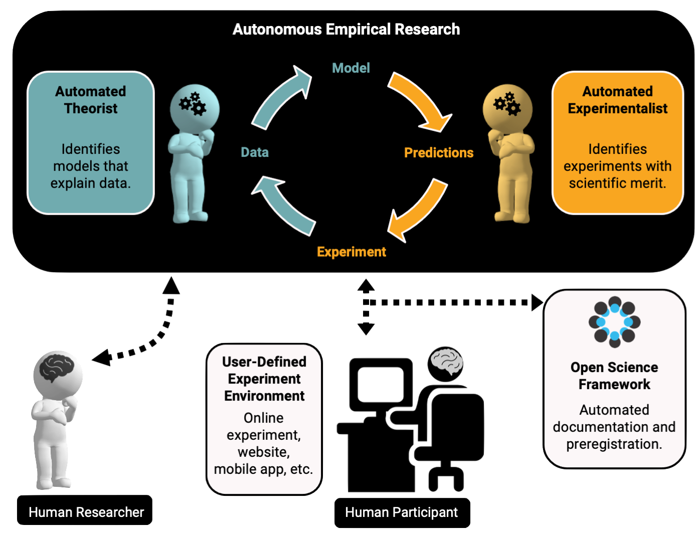

# Automated Research Assistant

<b>[AutoRA](https://pypi.org/project/autora/)</b> (<b>Au</b>tomated <b>R</b>esearch <b>A</b>ssistant) is an open-source framework for 
automating multiple stages of the empirical research process, including model discovery, experimental design, data collection, and documentation for open science.

AutoRA implements the <b>Autonomous Empirical Research Paradigm</b>, which involves a dynamic interplay 
between two artificial agents. ​The first agent, a theorist, relies on existing data to construct 
computational models by linking experimental conditions to dependent measures. The second agent, an 
experimentalist, designs follow-up experiments to refine and validate models generated by the theorist. 
Together, these agents enable a closed-loop scientific discovery process. In addition, AER interfaces 
with platforms for automated data collection, such as Prolific or Amazon Mechanical Turk, which enable 
the efficient acquisition of behavioral data from human participants.  

AutoRA was initially developed to accelerate research in the behavioral and brain sciences. 
However, it has been designed as a general framework that can automate research processes in
other empirical sciences, such as materials science or physics.

## Features

AutoRA consists of different modules that can be used independently or in combination, such as:

- <b>Automated theorists</b> that support the discovery of formal scientific models from data
- <b>Automated experimentalists</b> that support the design of follow-up experiments
- <b>Interfaces for automated data collection</b>, e.g., for behavioral experiments via Prolific or Amazon Mechanical Turk
- <b>Workflow logic</b> for defining interactions between different components of research processes
- <b>Interfaces for automated documentation</b> of research processes

## Usages

AutoRA can be used for a variety of purposes in empirical sciences, such as psychology, 
neuroscience, economics, physics, or materials science. Usages include:

- <b>Equation discovery</b> from empirical data
- <b>Experimental design</b> for follow-up experiments
- <b>Research documentation and dissemination</b>
- <b>Closed-loop empirical research</b>
- <b>Computational analyses of the scientific process</b> (metascience, computational philosophy of science)

## Motivation

Various empirical sciences are beset by replication crises, 
which can be attributed to inadequately precise hypotheses, lack of transparency
in research procedures, and insufficient rigor in testing findings. These causes
stem from three primary bottlenecks—a lack of formal modeling, onerous
 requirements of open science, and too few resources to reproduce 
individual studies. Empirical scientists struggle to formalize their 
theories, find it arduous to document their research activities, and often lack 
time and funds to conduct follow-up experiments to test and revise their
hypotheses. These limitations impede scientific progress and hinder
the development of new knowledge. We seek to overcome these limitations by providing
a framework and corresponding tools for the generation, estimation, and empirical testing of scientific models. 
It is our hope that AutoRA will accelerate scientific discovery 
as well as promote greater transparency and rigor in empirical research.

## Pointers

- [AutoRA Pip Package](https://pypi.org/project/autora/)
- [GitHub Repository](https://github.com/AutoResearch/autora)
- [Autonomous Empirical Research Group](http://www.empiricalresearch.ai)

## About

This project is being developed by the [Autonomous Empirical Research Group](https://musslick.github.io/AER_website/Research.html), which is led by [Sebastian Musslick](https://smusslick.com), in collaboration with the [Center for Computation and Visualization at Brown University](https://ccv.brown.edu).

Development of this package is supported by Schmidt Science Fellows, in partnership with the Rhodes Trust, as well as the Carney BRAINSTORM program at Brown University.

