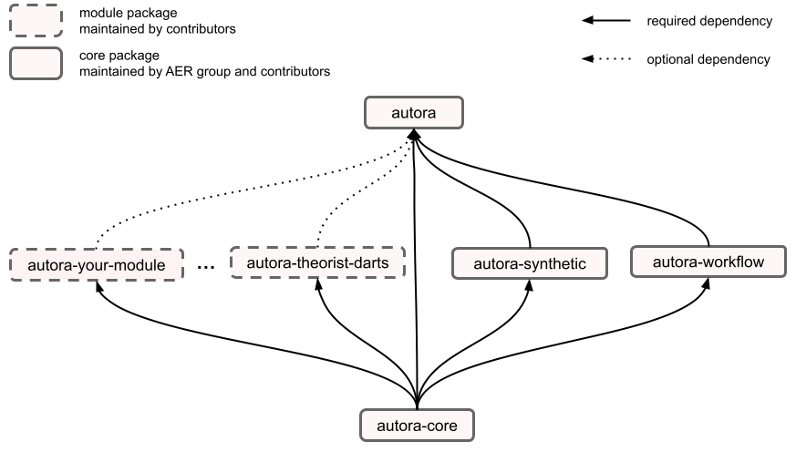

# Contributor Guide

The AutoRA project is a collection of packages which together form a framework for closed-loop empirical research.
We invite contributions to all parts of the project, including the ["core" packages](core.md), and the [modules](modules/index.md). Below is an overview of the project structure, along with brief mention of the style guide we follow as well as pointers to more detailed contribution guides for each part of the project.

!!! hint
    If you run into any issues or have any questions regarding a contribution to AutoRA, please reach out to us on the  
    [AutoRA forum](https://github.com/orgs/AutoResearch/discussions). We look forward to hearing from you!

## Project Structure

Contributions to AutoRA are organized into one "parent" and many "child" packages. 
Child packages are generally maintained by individual contributors. The parent package, along with some other 
*core* packages, is maintained by the [Autonomous Empirical Research Group](https://musslick.github.io/AER_website/Team.html), 
as well as external contributors.

[`autora`](https://github.com/autoresearch/autora) is the parent package which end users are expected to install. The
parent depends on core packages, such as [`autora-core`](https://github.com/autoresearch/autora-core), 
[`autora-workflow`](https://github.com/autoresearch/autora-workflow), and
[`autora-synthetic`](https://github.com/autoresearch/autora-synthetic). It also includes vetted modules (child packages) as optional dependencies which users can choose 
to install. 

You may contribute to any of the core packages or develop your own module as a stand-alone package (see below).    

## Style Guide

### Code Style

In general, AutoRA follows the [PEP 8 – Style Guide for Python Code](https://peps.python.org/pep-0008/). We particularly encourage the following conventions:

- Snake case for variables and modules: `example_name`, `example_module.py`
- Camel case for class names: `ExampleClass`
- Camel case with spaces for Jupyter notebooks: `Example Notebook.ipynb`
- Write docstrings for all public modules, functions, classes, methods, and at the top of each file.

### Documentation Style

For documenation, AutoRA adheres to the maxim, "Everything should be made as simple as possible, but no simpler." That is, we strive to make documenation clear and comprehensive, but as concise and digestible as possible. We also encourage formatting and hyperlinking that facilitate understanding and make navigation of the docs intuitive. Finally, we encourage a strong form of title case for headings — that is, for all titles and subtitles, the first letter of each word should be capitalized, such as in the following example: This Is An Example Title

## Module Contributions

Modules include theorists, experimentalists, experiment runners, or other functionalities not covered by the core packages. 
All modules are child packages and can become optional dependencies of the `autora` parent package. Modules packages are 
owned and maintained by you, the contributor, which provides several advantages:

- **Easy setup**: We provide simple [templates](modules/index.md) for modules, which you can use to get started quickly
- **Independence**: You can develop and maintain your package independently of other child packages (and thereby avoid dependency conflicts)
- **Ownership**: You can publish your package on PyPI or Conda, use it in other projects, and get credit for its use. 

For details on how to submit child packages 
for inclusion in `autora`, see
[the module contributor guide](modules/index.md). Feel free to post questions and feedback regarding module contributions on the 
[AutoRA forum](https://github.com/orgs/AutoResearch/discussions/categories/module-contributions).

## Core Contributions

The following packages are considered core packages, and are actively maintained by the
[Autonomous Empirical Research Group](https://musslick.github.io/AER_website/Team.html):

- **autora-core** [`https://github.com/autoresearch/autora-core`](https://github.com/autoresearch/autora-core) This package includes fundamental utilities
and building blocks for all the other packages. This is always installed when a user installs `autora` and can be 
a dependency of other child packages.   

- **autora-workflow** [`https://github.com/autoresearch/autora-workflow`](https://github.com/autoresearch/autora-workflow): The workflow package includes basic utilities for managing the workflow of closed-loop research processes, e.g., coordinating workflows between the theorists, experimentalists, and experiment runners. Though it currently stands alone, this package will ultimately be merged into autora-core.

- **autora-synthetic** [`https://github.com/autoresearch/autora-synthetic`](https://github.com/autoresearch/autora-synthetic): This package includes a number of ground-truth models from different scientific disciplines that can be used for benchmarking automated scientific discovery. If you seek to contribute a scientific model, please see the [core contributor guide](core.md) for details.   

We welcome contributions to
these packages in the form of pull requests, bug reports, and feature requests. For more details, see the
[core contributor guide](core.md). Feel free to ask any questions or provide any feedback regarding core contributions on the 
[AutoRA forum](https://github.com/orgs/AutoResearch/discussions/categories/core-contributions).

For core contributions, including contributions to [`autora-synthetic`](https://github.com/autoresearch/autora-synthetic), it is possible to set up your python environment in many different ways. 
One setup which works for us is described in [the setup guide](setup.md).

!!! hint
    If you would like to become actively involved in the development and maintenance of core AutoRA packages, 
    we welcome you to [join the Autonomous Empirical Research Group](https://musslick.github.io/AER_website/Team.html).

