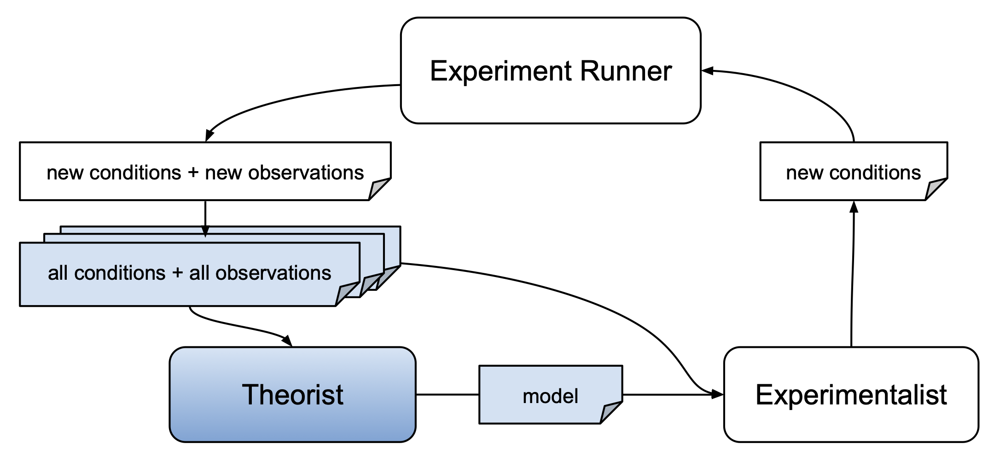

# Contribute a Theorist

AutoRA theorists are meant to return scientific models describing the relationship between experimental conditions
and observations. Such models may take the form of a simple linear regression, non-linear equations, causal graphs, 
a more complex neural network, or other models which 
- can be identified based on data (and prior knowledge)
- can be used to make novel predictions about observations given experimental conditions.



All theorists are implemented as `sklearn` regressors. It is fitted based on experimental conditions and respective
observations, and can be used to predict observations for new experimental conditions.

## Repository Setup

We recommend using the [cookiecutter template](https://github.com/AutoResearch/autora-template-cookiecutter) to set up
a repository for your theorist. Alternatively, you use the 
[unguided template](https://github.com/AutoResearch/autora-template). If you are using the cookiecutter template, you can set up your repository using

```shell
cookiecutter https://github.com/AutoResearch/autora-template-cookiecutter
```

Make sure to select the `theorist` option when prompted. You can skip all other prompts pertaining to other modules 
(e.g., experimentalists) by pressing enter.

## Implementation

Once you created your repository, you can implement your theorist by editing the `init.py` file in 
``src/autora/theorist/name-of-your-theorist/``. You may also add additional files to this directory if needed. 
It is just important that the `init.py` file contains a class called `NameOfYourTheorist` which inherits from  
`sklearn.base.BaseEstimator` and implements the following methods:

- `fit(self, conditions, observations)`
- `predict(self, conditions)`

See the [sklearn documentation](https://scikit-learn.org/stable/developers/develop.html) for more information on 
how to implement the methods. The following example ``init.py`` illustrates the implementation of a simple theorist
that fits a polynomial function to the data:

```python 

"""
Example Theorist
"""

import numpy as np
from sklearn.base import BaseEstimator


class ExampleRegressor(BaseEstimator):
    """
    This theorist fits a polynomial function to the data.
    """

    def __init__(self, degree: int = 2):
        self.degree = degree

    def fit(self, conditions, observations):

        # fit polynomial
        self.coeff = np.polyfit(conditions, observations, 2)
        self.polynomial = np.poly1d(self.coeff)
        pass

    def predict(self, conditions):
        return self.polynomial(conditions)
```

## Testing

You can add unit tests to the `tests` folder in your repository. If you generated your repository using cookiecutter,
you can add your tests to the `tests/test_yourmodulename.py` file.
To test your theorist, you can run the tests using

```shell
pytest
```

from the root directory of your repository. This will run the tests in the `tests` folder. You can also add additional
tests to this folder if needed. 

## Documentation

To add documentation, you can edit the `docs` folder. In particular, you can edit the `docs/index.md` 
file to add documentation for your theorist. You are also encouraged to the basic usage of your theorist in the 
python notebook ``Basic Usage.ipynb`` in the `docs` folder. Finally you can outline the basic setup of your theorist in 
the `docs/quickstart.md` file.

You can also add additional documentation files and notebooks to the `docs/` folder if needed. 
Should your package meet requirements for
inclusion in the parent ``autora`` parent package, the theorist documentation will be automatically added to the 
[main documentation](https://autoresearch.github.io/autora/) of AutoRA under the subcategory "Theorists". 

See the [guideline for module contributions](module.md) for more details on how to update your documentation and package. 


## Publishing

Please follow the instructions outlined in the [guideline for module contributions](module.md) to publish your theorist.

## Adding your module to the autora parent package

Once you've published your theorist on PyPI, you can announce it in the 
[AutoRA forum](https://github.com/orgs/AutoResearch/discussions/categories/module-announcements). You can then indicate
in your post if you wish your theorist to be included in the autora package. Alternatively, you can also
[contact us directly](https://musslick.github.io/AER_website/Contact.html).
