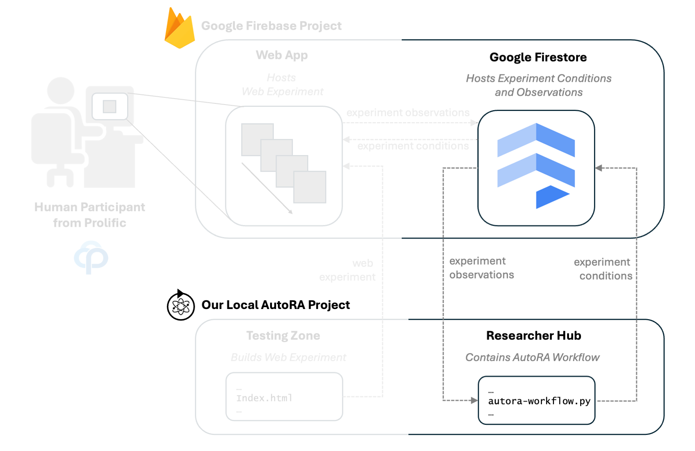
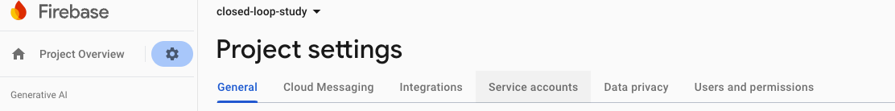

# Connect AutoRA WorkFlow to Firebase

After setting up a mechanism to deploy your experiments online, you can now connect the AutoRA workflow to Firestore database. This will allow us to update experiment conditions and to download observations collected from the experiment.



The workflow will manage the entire research process, from generating novel experiments to collecting data and modeling the results. 

Note that the workflow will talk to the Firebase project by uploading and downloading data to the Firestore database. We will upload new experiment conditions to the database and download the results of the experiment from it. 

The AutoRA workflow can be found in the `researcher_hub` folder, which contains a template for an AutoRA workflow for a two-armed bandit task using a model discovery process (AutoRA-theorist) described here: [rnn-sindy-rl](https://github.com/AutoResearch/autora-theorist-rnn-sindy-rl).

- Move into the `researcher_hub` directory, where the template for the workflow is stored.

```shell
cd researcher_hub
```

-  Then install the Python packages required for the workflow using `pip`. This may take some time:

```shell
pip install -r requirements.txt
```

## Add Firebase Credentials

The workflow will make use of the following three different experiment runners:
   - `autora-synthetic-runner`: This runner is used to run the AutoRA workflow with simulated data from a reinforcement learning model.
   - `autora-firebase-runner`: This runner is used to run the AutoRA workflow with Firebase. It will upload new experiment conditions to the Firestore database and download the results of the experiment from it. This can be used to test the online experiment.
   - `autora-prolific-runner`: This runner is used to run the AutoRA workflow with Prolific. It will recruit participants via Prolific and upload the results of the experiment to Prolific.
   
The AutoRA workflow (specifically the `autora-firebase-runner` and `autora-prolific-runner`) will need access to your firebase project. Therefore, we need the corresponding credentials. 

- To obtain the credentials, go to the [Firebase console](https://console.firebase.google.com/).
- Navigate to the project.
- Click on the little gear on the left and then select ``Project settings``. 
- Click on ``Service accounts``.

- Having ``Node.js`` selected, click ``Generate a new private key``. This should generate a json file that you can download.
- Open the file `autora_workflow.py` in the `researcher_hub`-folder and navigate to the part of the code that contains a placeholder for the credentials. It should look like this
```python
firebase_credentials = {
    "type": "type",
    "project_id": "project_id",
    "private_key_id": "private_key_id",
    "private_key": "private_key",
    "client_email": "client_email",
    "client_id": "client_id",
    "auth_uri": "auth_uri",
    "token_uri": "token_uri",
    "auth_provider_x509_cert_url": "auth_provider_x509_cert_url",
    "client_x509_cert_url": "client_x509_cert_url"
}
```
- Replace the placeholders with the credentials from the json file you downloaded.

## Try out the Workflow

In this section, we will simply check whether the code executes. The next section will explain in more detail what is happening in the workflow. 

### Synthetic Experiment Runner

First try the synthetic runner to see if everything works correctly.

- Within your environment, you can now run `python autora_workflow.py`.

The code should now execute using a synthetic loop. In the next section, we explain in more detail what is happening.  For now, you may just want to check if the code runs without errors.

### Firebase Experiment Runner

- To run the AutoRA workflow with the actual web experiment on Firebase, you need to change the experiment runner. Replace ``RUNNER_TYPE = 'synthetic' `` in the beginning of the `autora_workflow.py` file with

```python
RUNNER_TYPE = 'firebase'
```

- Now run the workflow again with `python autora_workflow.py`.

- Head over to your website to test participate in the online experiment. You can find the link in the [Firebase console](https://console.firebase.google.com/). Navigate to your project and select ``Hosting`` in the left navigation menu. The domain of your experiment is listed on top under ``Domains``.


- This will be the experiment as participants will see it. Your task in the experiment is to select the colored box that provides a reward, i.e., a point. Which box is rewarded is stochastic and will change over time.


- Complete the experiment. 

- You can now check if the results of your experiment are properly stored in the Firebase database. To check the database, go to the Firebase console and select your project. On the left menu, navigate to ``Firestore Database``. If everything worked, you should see database fields called ``autora_in`` and ``autora_out``. The former contains the experiment conditions which are used to configure the experiment. The latter will contain the results of the experiment. If you click on ``autora_out`` *after you completed the experiment*, you should see a field such as ``0`` with the results of the experiment. 


[Next: Workflow Explanation.](workflow.md)

