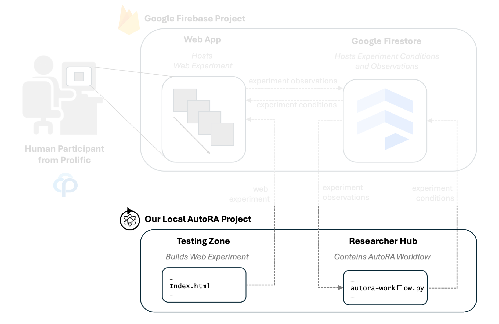
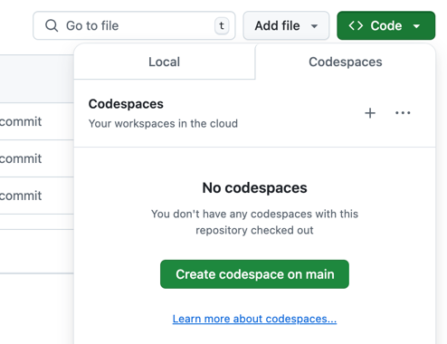
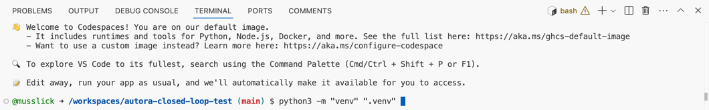
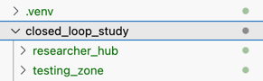

# Set Up Project

First, we need to set up our local AutoRA project.



## Create Repository
To ease the setup process for this example, we provide a template repository that contains all the necessary files and configurations. 

Simply visit the following repository on GitHub: [https://github.com/AutoResearch/autora-closed-loop-firebase-prolific-bandit-task](https://github.com/AutoResearch/autora-closed-loop-firebase-prolific-bandit-task)

Next, click on the green "Use this template" button to create a new repository in your account.


You may then enter the name of the repository (e.g., "closed-loop-study") and click on the "Create repository" button.

## Clone Repository or Open it in GitHub Codespace

Once you created your own repository from the template, you can clone it to your local machine using ``git clone``. However, we recommend using GitHub Codespaces for this example, as it provides a more streamlined development environment.

To open the repository in GitHub Codespaces, click on the ``Code`` button and select ``Create codespace on main``.


## Set Up Environment

Once you cloned your repository or opened it in Codespaces, it is time to set up your environment. Here, we will use a Python virtual environment to manage dependencies.

!!! success
    We recommend setting up your development environment using a manager like `venv`, which creates isolated python 
    environments. Other environment managers, like 
    [virtualenv](https://virtualenv.pypa.io/en/latest/),
    [pipenv](https://pipenv.pypa.io/en/latest/),
    [virtualenvwrapper](https://virtualenvwrapper.readthedocs.io/en/latest/), 
    [hatch](https://hatch.pypa.io/latest/), 
    [poetry](https://python-poetry.org), 
    are available and will likely work, but will have different syntax to the syntax shown here. Our packages are set up using `virtualenv` with `pip`.

- In the `<project directory>`, run the following command to create a new virtual environment in the `.venv` directory

```shell
python3 -m "venv" ".venv" 
```


!!! hint
    If you have multiple Python versions installed on your system, it may be necessary to specify the Python version when creating a virtual environment. For example, run the following command to specify Python 3.8 for the virtual environment. 
    ```shell
    python3.8 -m "venv" ".venv" 
    ```

- Activate it by running
```shell
source ".venv/bin/activate"
```

## Install Dependencies

- First, install the cookiecutter package using pip via

```shell
pip install cookiecutter
```

We will use this package to automatically configure our project folder structure. 

- Then we install some python dependencies:
```shell
pip install -r requirements.txt
```

- We will also install firebase-tools:
```shell
npm install -g firebase-tools
```

We will use this package to deploy our firebase functions for storing data.

!!! hint
    If you encounter any issues with the installation, make sure that you have the necessary permissions to install packages on your system. You may need to run the commands with `sudo` or as an administrator.

## Set Up Project Folder with Coockiecutter

To establish an online closed-loop for AutoRA, there are two key components that need to be configured:

1. AutoRA Workflow
    - This workflow can be executed locally, on a server, or using `Cylc`. It must have the ability to communicate with a website, allowing for the writing of new conditions and reading of observation data.
    - The AutoRA workflow can be customized by adding or removing AutoRA functions, such as AutoRA *experimentalists* or AutoRA *theorists*. It relies on an AutoRA Prolific Firebase *runner* to collect data from an online experiment hosted via Firebase and recruit participants via prolific.

2. Website To Conduct Experiment:
    - The website serves as a platform for conducting experiments and needs to be compatible with the AutoRA workflow.
    - In this setup, we use `Firebase` to host on website.

To simplify the setup process, we provide a `cookiecutter` template that generates a project folder containing the following two directories:

1. ``researcher_hub``:
    - This directory includes a basic example of an AutoRA workflow.

2. ``testing_zone``:
    - This directory provides a basic example of a website served with Firebase, ensuring compatibility with the AutoRA workflow.

Once you installed the packages above, you can create the project by running the following command in the root directory of your project:

```shell
cookiecutter https://github.com/AutoResearch/autora-user-cookiecutter
```

If cookiecutter is not recognized, you may need to run the following command:

```shell
python -m cookiecutter https://github.com/AutoResearch/autora-user-cookiecutter
```

- You will be prompted to enter some information about your project. You can select single options by pressing SPACE and confirm your selection by pressing ENTER.
  1. You may first enter a project name, e.g., "closed-loop-study".
  2. Select ``yes`` to use advanced features.
  3. We are going to use a theorist from a different package, so we don't need to select any theorist here.
  4. Choose at least ``autora[experimentalist-bandit-random]`` and ``autora[experimentalist-model-disagreement]``.
  5. Make sure to select the ``autora[experiment-runner-firebase-prolific]`` option
  6. Select ``yes`` to set up a firebase experiment. When asked to install further packages (create-react-app@5.0.1), select yes (y). This may take some time.
  7. Finally, select ``JsPsych - Bandit`` as project type.

You should now have the following project structure:



!!! hint
    If you encounter any issues with the cookiecutter setup, make sure that you have the necessary permissions to install packages on your system. You may need to run the commands with `sudo` or as an administrator.

[Next: Set up Firebase to host our experiment.](firebase.md)


