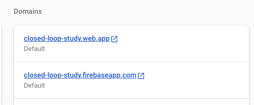
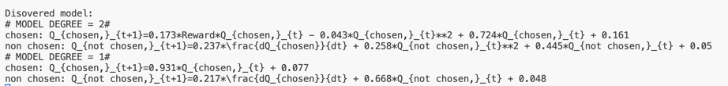
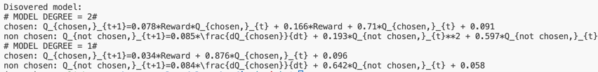

# Testing the Workflow

Now that we have a better understanding of the workflow, let's test it out for real.

- Navigate to the `researcher_hub` folder and open the `autora_workflow.py` file.
- Change the number of participants per cycle to ``1``:
```python
PARTICIPANTS_PER_CYCLE = 1
```
In this way, you only have to perform the experiment once to advance the workflow cycle.

- Also, change the number of cycles to ``2``:
```python
CYCLES = 2
```

- Finally, we will adjust the number of epochs we train the neural network for. We will set it to ``100``:
```python
EPOCHS = 100
```

!!! hint
    If you want to speed up the testing process, you can also set the number of experiment trials to a lower number, e.g., ``TRIALS_PER_PARTICIPANTS = 30``. However, this will likely yield a poorer model fit. 

- Run the workflow with `python autora_workflow.py`.
- Once it is running, head over to your website to test participate in the online experiment. You can find the link in the [Firebase console](https://console.firebase.google.com/). Navigate to your project and select ``Hosting`` in the left navigation menu. The domain of your experiment is listed on top under ``Domains``.



- Complete the experiment.
- Check the console output of the `autora_workflow.py` file to see if the data was collected correctly. If everything worked, you should see the discovered reinforcement learning equations in the console output: 



The output displays a latex formatting of the equations. ``Q_{chosen,}`` refers to the value of the chosen box and ``Q_{not chosen,}`` refers to the value of the non-chosen box. The right hand side of the equation specifies how each of these values are updated as a function of the current value ``Q_{chosen,}_{t}`` or the reward received ``Reward``. 

- Once the model output is displayed, the workflow will upload a new experiment. You should now be able to complete the experiment one more time. This time, the workflow selected an experiment that it thinks best differentiates between the two identified models. 
- After you complete the experiment one more time, the workflow will fit the two models again to the collected data. 
- Once the two cycles are completed, and the workflow script finished, you should see the final models listed in the console.



- **Congratulations**, you just set up and ran a closed-loop reinforcement learning study!

[Next: Connect your closed-loop experiment with Prolific in order to recruit real participants.](prolific.md)
