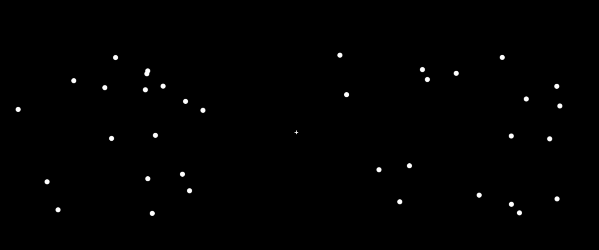
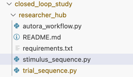

# Constructing the Experiment

In this study, we will want to design a simple psychophysics experiment in which participants are tasked to decide which of two sets of dots has more dots. 

In this part of the example, we will code up two functions, one function ``trial_sequence`` for generating a sequence of experiment conditions, and another function ``stimulus_sequence`` for compiling the corresponding experiment. We will need both functions to run the AutoRA workflow. Accordingly, we will integrate these functions into the Researcher Hub.

!!! hint
    Below, we will leverage other packages, such as SweetPea and SweetBean for generating experiment sequences and stimulus sequences, respectively. That said, you are not required to use those packages; you can also write your own functions for generating experiment sequences and stimulus sequences.

## Experiment Overview



### Independent and Dependent Variables

The experiment has two independent variables: The number of dots in the first set and the number of dots in the second set. The dependent variable is the participant's response, i.e., whether they correctly identified which set has more dots.

### Procedure

The experiment will consist of a series of 20 trials. Each trial begins with the display of a fixation cross. After a short delay, two sets of dots will be displayed, one at the left and one at the right. Participants will be asked to perform a same-different task, i.e., to select whether the number of dots in the two sets is the same by pressing ``y`` or not by pressing ``n``.

### Stimuli

The stimuli consist of two sets of dots. The number of dots in each set can range from 1 to 100 and is determined by the AutoRA Workflow. Here, for simplicity, we constrain each experiment such that there are only two possible values for the number of dots in each set.

## Generating Trial Sequences With SweetPea

Next, we want to write a function that generates a counterbalanced sequence of trials, i.e., a list of trials that ensures that each condition appears equally often in each position of the sequence. 

Here, we will generate such a sequence of trials using [SweetPea](https://sites.google.com/view/sweetpea-ai). SweetPea is a declarative language implemented in Python that allows you to define experimental designs in a concise and readable way, and to automatically generate counterbalanced sequences of trials.

!!! hint
    If you want to tinker with the SweetPea code just for this example, you can open the corresponding notebook in Google Colab by clicking the following badge:
    [](https://colab.research.google.com/github/AutoResearch/autora/blob/main/docs/examples/closed-loop-basic/notebooks/sweetpea.ipynb)

The following function generates an experimental sequence of at least ``min_trials`` trials. Each trial consists of two conditions: the number of dots in the first set (``num_dots_1``) and the number of dots in the second set (``num_dots_2``). The function ``trial_sequence`` returns a list of dictionaries, where each dictionary represents a trial of a counterbalanced experiment sequence

```python
from sweetpea import Factor, MinimumTrials, CrossBlock, synthesize_trials, CMSGen, experiments_to_dicts

def trial_sequence(num_dots_1, num_dots_2, min_trials):

  # define regular factors
  num_dots_left = Factor('dots left', [num_dots_1, num_dots_2])
  num_dots_right = Factor('dots right', [num_dots_1, num_dots_2])

  # define experimental block
  design = [num_dots_left, num_dots_right]
  crossing = [num_dots_left, num_dots_right]
  constraints = [MinimumTrials(min_trials)]

  block = CrossBlock(design, crossing, constraints)

  # synthesize trial sequence
  experiment = synthesize_trials(block, 1, CMSGen)

  # export as dictionary
  return experiments_to_dicts(block, experiment)[0]
```

### Integrating the Code Into the Researcher Hub

- Create a new python script in the ``researcher_hub`` folder and name it ``trial_sequence.py``. Copy the code above into the script.
- To execute the script you will also need to ``pip install sweetpea`` in your virtual environment.
- Make sure to add ``sweetpea`` as a dependency in the ``requirements.txt`` file within the ``researcher_hub`` folder.

Below, we elaborate a bit more on the code. However, if you are already familiar with SweetPea, you may skip the "Explanation" section. Alternatively, you can gain an intuition for the code in the corresponding notebook:  [](https://colab.research.google.com/github/AutoResearch/autora/blob/main/docs/examples/closed-loop-basic/notebooks/sweetpea.ipynb). 

### Code Explanation 

The first two lines define the experimental factors. 
```python
num_dots_left = Factor('dots left', [num_dots_1, num_dots_2])
num_dots_right = Factor('dots right', [num_dots_1, num_dots_2])
```

The first experimental factor indicates the number of dots in the left stimulus. It has two levels, i.e., two possible values for the number of dots, which is given by ``num_dots_1`` and ``num_dots_2``. The same goes for the second experimental factor, which indicates the number of dots in the right stimulus.

The next lines defines the experimental design, which includes all experimental factors, irrespective of whether they are counterbalanced or not.
```python
design = [num_dots_left, num_dots_right]
```

The next line defines the crossing of the experimental factors, i.e., the conditions that need to be counterbalanced.
```python
crossing = [num_dots_left, num_dots_right]
```

Then, we define the constraints of the experimental design. Here, we only have one constraint, which is to have a minimum number of trials, which is given by ``min_trials``.
```python
constraints = [MinimumTrials(min_trials)]
```

Finally, we define the experimental block, which includes the design, crossing, and constraints.
```python
block = CrossBlock(design, crossing, constraints)
```

The next line synthesizes the experimental sequence. The function ``synthesize_trials`` generates a counterbalanced sequence of trials based on the experimental block.
```python
experiment = synthesize_trials(block, 1, CMSGen)
```

The last line exports the experimental sequence as a list of dictionaries. Here, we only care about a single experiment, so we select the first one in the list.
```python
return experiments_to_dicts(block, experiment)[0]
```

## Generating the Stimulus Sequences With SweetBean

Next, we need to write a function that automates the generation of our web-based experiment, which is then sent to Firebase.

Here, we will generate such a web experiment using [SweetBean](https://autoresearch.github.io/sweetbean/). SweetBean is a declarative language implemented in Python that allows you to define describe a sequence of events for an experiment in Python, and then generate a corresponding web-based experiment in JavaScript.

- Within your current environment, make sure to install the latest version of SweetBean directly from the GitHub repository:
```shell
pip install sweetbean 
```


The following function generates JavaScript code for a web-based experiment. The experiment corresponds to a sequence of stimuli, thereby we call it ``stimulus_sequence``. It returns a string that contains the JavaScript code for the experiment.

Note that the function receives as input a ``timeline`` specifying a sequence of timeline variables. This timeline corresponds to the trial sequence generated by the SweetPea program above.

!!! hint
    If you want to tinker with the SweetBean code just for this example, you can open the corresponding notebook in Google Colab by clicking the following badge:
    [](https://colab.research.google.com/github/AutoResearch/autora/blob/main/docs/examples/closed-loop-basic/notebooks/sweetbean.ipynb)

```python
from sweetbean.stimulus import Text, Fixation, RandomDotPatterns
from sweetbean import Block, Experiment
from sweetbean.variable import TimelineVariable

def stimulus_sequence(timeline):

  # INSTRUCTION BLOCK
  
  # generate several text stimuli that serve as instructions
  introduction_welcome = Text(text='Welcome to our perception experiment.<br><br> \
                                          Press the SPACE key to continue.', 
                                    choices=[' '])
  
  introduction_pictures = Text(text='Each picture contains two sets of dots, one left and one right.<br><br>\
                                       Press the SPACE key to continue.', 
                                    choices=[' '])
  
  introduction_responses = Text(text='You have to indicate whether the two sets contain an equal number of dots.<br><br>\
                                       Press the y-key for yes (equal number) and<br> the n-key for no (unequal number).<br><br>\
                                       Press the SPACE key to continue.', 
                                    choices=[' '])
  
  introduction_note = Text(text='Note: For each picture, you have only 2 seconds to respond, so respond quickly.<br><br>\
                                       You can only respond with the y and n keys while the dots are shown.<br><br> \
                                       Press the SPACE key to BEGIN the experiment.', 
                                    choices=[' '])
  

  # create a list of instruction stimuli for the instruction block
  introduction_list = [introduction_welcome, 
                       introduction_pictures, 
                       introduction_responses, 
                       introduction_note]

  # create the instruction block
  instruction_block = Block(introduction_list)

  # EXIT BLOCK

  # create a text stimulus shown at the end of the experiment
  instruction_exit = Text(duration=3000, 
                                  text='Thank you for participating in the experiment.', 
                                  )

  # create a list of instruction stimuli for the exit block
  exit_list = [instruction_exit]

  # create the exit block
  exit_block = Block(exit_list)

  # TASK BLOCK

  # define fixation cross
  fixation = Fixation(1500)

  # define the stimuli features as timeline variables
  dot_stimulus_left = TimelineVariable('dots left')
  dot_stimulus_right = TimelineVariable('dots right')

  # We can define a stimulus as a function of those stimulus features
  rdp = RandomDotPatterns(
      duration=2000,
      number_of_oobs=[dot_stimulus_left, dot_stimulus_right],
      number_of_apertures=2,
      choices=["y", "n"],
      background_color="black",
  )

  # define the sequence of events within a trial
  event_sequence = [fixation, rdp]

  # group trials into blocks
  task_block = Block(event_sequence, timeline)

  # EXPERIMENT

  # define the entire experiment
  experiment = Experiment([instruction_block, task_block, exit_block])

  # return a js string to transfer to autora
  return experiment.to_js_string(as_function=True, is_async=True)
```

### Integrating the Code Into the Researcher Hub

- Create a new python script in the ``researcher_hub`` folder and name it ``stimulus_sequence.py``. Copy the code above into the script.
- If sweetbean isn't already installed in your virtual environment, you will also need to install it with``pip install sweetbean``.
- If it isn't already added, make sure to add ``sweetbean`` as a dependency in the ``requirements.txt`` file within the ``researcher_hub`` folder.

Once both functions are integrated both functions, your researcher hub should contain the following files:
- ``autora_workflow.py``
- ``trial_sequence.py``
- ``stimulus_sequence.py``



Below, we elaborate a bit more on the code. However, if you are already familiar with SweetBean, you may skip the "Explanation" section. Alternatively, you can gain an intuition for the code in the corresponding notebook:  [](https://colab.research.google.com/github/AutoResearch/autora/blob/main/docs/examples/closed-loop-basic/notebooks/sweetbean.ipynb). 


### Code Explanation

SweetBean organizes events into event sequences, and event sequences into blocks. Event sequences may correspond to trials, and blocks correspond to a sequence of experiment trials. 

First, we define the instruction block, which consists of a series of text stimuli that provide instructions to the participants. Each text stimulus is defined as a ``Text`` object. The ``Text`` object takes as input the text to be displayed and the choices that the participant can make. The choices are defined as a list of keys that the participant can press to continue to the next instruction. In this case, the participant can continue by pressing the ``SPACE`` key.

```python
# generate several text stimuli that serve as instructions
  introduction_welcome = Text(text='Welcome to our perception experiment.<br><br> \
                                          Press the SPACE key to continue.', 
                                    choices=[' '])
  
  introduction_pictures = Text(text='Each picture contains two sets of dots, one left and one right.<br><br>\
                                       Press the SPACE key to continue.', 
                                    choices=[' '])
  
  introduction_responses = Text(text='You have to indicate whether the two sets contain an equal number of dots.<br><br>\
                                       Press the y-key for yes (equal number) and<br> the n-key for no (unequal number).<br><br>\
                                       Press the SPACE key to continue.', 
                                    choices=[' '])
  
  introduction_note = Text(text='Note: For each picture, you have only 2 seconds to respond, so respond quickly.<br><br>\
                                       You can only respond with the y and n keys while the dots are shown.<br><br> \
                                       Press the SPACE key to BEGIN the experiment.', 
                                    choices=[' '])
```

The following code turns these stimuli into a list, which is then compiled into an instruction block.

```python
# create a list of instruction stimuli for the instruction block
  introduction_list = [introduction_welcome, 
                       introduction_pictures, 
                       introduction_responses, 
                       introduction_note]

  # create the instruction block
  instruction_block = Block(introduction_list)
```

Similarly, we can define instructions for the end of the experiment. In this case, we present just a single sentence for the duration of 3000 milliseconds.

```python
# EXIT BLOCK

  # create a text stimulus shown at the end of the experiment
  instruction_exit = Text(duration=3000, 
                                  text='Thank you for participating in the experiment.', 
                                  )

  # create a list of instruction stimuli for the exit block
  exit_list = [instruction_exit]

  # create the exit block
  exit_block = Block(exit_list)
```


Next, we define the task block. This block consists of the experimental trials, which are defined as a sequence of events. Here, we define two events, a fixation cross and a random dot pattern stimulus. Let's begin with the fixation cross, which is shown for 1500ms:

```python
# TASK BLOCK

  # define fixation cross
  fixation = Fixation(1500)
```

The random dot pattern stimulus is parameterized by two stimulus features, ``dot_stimulus_left`` and ``dot_stimulus_right``, which correspond to the number of dots in the left and right stimulus, respectively. These stimulus features are defined as ``TimelineVariable`` objects. These objects are updated based on the timeline, i.e., the trial sequence, provided to the function. The ``TimelineVariable`` object takes as input the name of the variable.

```python
# define the stimuli features as timeline variables
  dot_stimulus_left = TimelineVariable('dots left')
  dot_stimulus_right = TimelineVariable('dots right')
```

Next, we define the random dot pattern stimulus, as a ``RandomDotPatterns`` object, which is shown for 2000ms (``duration=2000``). It consists of two set of dots (``number_of_apertures=2``), which are parameterized by the two timeline variables ``number_of_oobs=[dot_stimulus_left, dot_stimulus_right]``. Finally, we allow participants to record a response on each stimulus, indicating whether the dots match or not by pressing the respective keys for `y` and `n` (``choices=["y", "n"]``)

```python
# We can define a stimulus as a function of those stimulus features
  rdp = RandomDotPatterns(
      duration=2000,
      number_of_oobs=[dot_stimulus_left, dot_stimulus_right],
      number_of_apertures=2,
      choices=["y", "n"],
      background_color="black",
  )
```

Lastly we group the events into a block, which we call the task block.

```python
# define the sequence of events within a trial
  event_sequence = [fixation, rdp]

  # group trials into blocks
  task_block = Block(event_sequence, timeline)
```

Finally, we define the entire experiment, which consists of the instruction block, the task block, and the exit block.

```python
# EXPERIMENT

  # define the entire experiment
  experiment = Experiment([instruction_block, task_block, exit_block])
```

The last line returns the experiment as a JavaScript string, which can be sent to Firebase.

```python
# return a js string to transfer to autora
  return experiment.to_js_string(as_function=True, is_async=True)
```

## Updating the Testing Zone

Now that we have code for generating the jsPsych experiment, we want to make sure that our testing_zone can deploy it to firebase.

Head over to the `testing_zone` folder:

```shell
cd testing_zone
```

Make sure to include the following lines in the `main.js` file in `testing_zone/src/design`:
```javascript
import jsPsychRok from '@jspsych-contrib/plugin-rok'
global.jsPsychRok = jsPsychRok
```

In this example, we will generate the entire js Psych experiment in the workflow, we will be sending the full JavaScript code to the testing zone. Replace the `main` function in the `main.js` file with the following code:

```javascript
const main = async (id, condition) => {
    const observation = await eval(condition['experiment_code'] + "\nrunExperiment();");
    return JSON.stringify(observation)
}
```

Your ``main.js`` file should now look like this:

```javascript
import { initJsPsych } from 'jspsych';
import 'jspsych/css/jspsych.css'
import 'sweetbean/dist/style/main.css';
import 'sweetbean/dist/style/bandit.css';
import htmlKeyboardResponse from '@jspsych/plugin-html-keyboard-response';
import jsPsychRok from '@jspsych-contrib/plugin-rok'

global.jsPsychRok = jsPsychRok
global.initJsPsych = initJsPsych;
global.jsPsychHtmlKeyboardResponse = htmlKeyboardResponse

/**
 * This is the main function where you program your experiment. For example, you can install jsPsych via node and
 * use functions from there
 * @param id this is a number between 0 and number of participants. You can use it for example to counterbalance between subjects
 * @param condition this is a condition (for example uploaded to the database with the experiment runner in autora)
 * @returns {Promise<*>} after running the experiment for the subject return the observation in this function, it will be uploaded to autora
 */
const main = async (id, condition) => {
    const observation = await eval(condition['experiment_code'] + "\nrunExperiment();");
    return JSON.stringify(observation)
}

export default main
```

Once the ``main.js`` file is updated, you can rebuild and deploy the website:

```shell
npm run build
firebase deploy
```


## Next Steps

[Next: Add a preprocessing script for the data generated by the experiment.](preprocessing.md)

