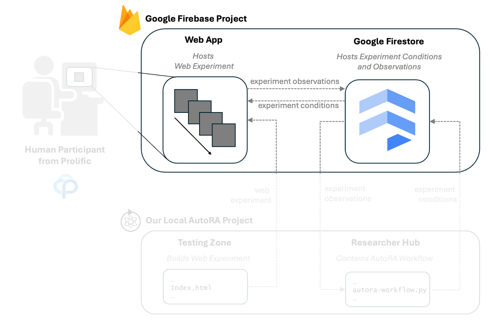
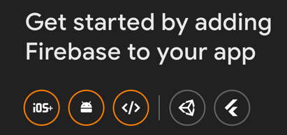
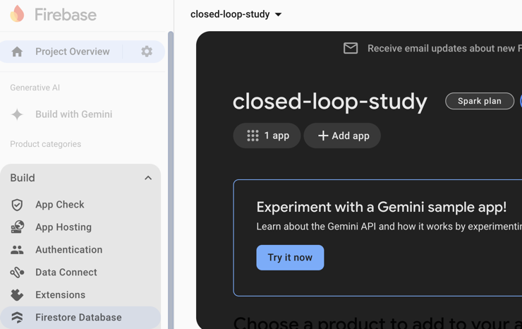

# Set Up The Project On The Firebase Website

Next, we want to set up Firebase for our project. 



Firebase is a platform developed by Google for creating mobile and web applications. Here, we will leverage firebase as a platform for hosting our web-based behavioral experiment, and firestore for hosting associated experimental data.

To serve a website via Firebase and use the Firestore Database, it is necessary to set up a Firebase project. Follow the steps below to get started:

## Google Account
You'll need a [Google account](https://www.google.com/account/about/) to use Firebase.

## Firebase Project
- While logged in into your Google account, head over to the [Firebase website](https://firebase.google.com/). Then, create a new project:

  1. Click on `Get started`.
  2. Click on the plus sign with `Create a project`.
  3. Name your project (e.g., ``closed-loop-study``) and click on `Continue`.
  4. As we don't need Google Analytics, we can leave it disabled (you can leave it enabled if you want to use it in the future).
  5. Click `Create project`.

## Adding a Web App to Your Project
- Now, we add a web app to the project, which will correspond to our web experiment. Navigate to the project and follow these steps:
  1. Click on ```<\>```.
  
  2. Name the app (can be the same as your project) and check the box `Also set up Firebase Hosting`. Click on `Register app`.
  3. Select `Use npm`. We will use the configuration details later, but for now, click on `Next`.
  4. We will install firebase tools later, for now, click on `Next`.
  5. We will log in and deploy our website later, for now, click on `Continue to console`.

## Adding Firestore To Your Project
For our closed-loop study, we will use a Firestore Database to communicate between the AutoRA workflow and the website conducting the experiment. We will upload experiment conditions to the database and also store experiment data in the database. 
- To build a Firestore Database, follow these steps:
  1. In the left-hand menu of your project console, click on `Build` and select `Firestore Database`.
  
  2. Click on `Create database`.
  3. Select a location for the server hosting the database. Click on `Next`. Note that your institution may have restrictions on the location of the server. Click `Next`
  4. Select `Start in production mode` selected and click `Create`.

You have now configured Firebase for your project. Next, we will connect your local project to Firebase and deploy your web-based experiment.

## Next Steps

[Next: Connect your local project with Firebase.](testingzone.md)
