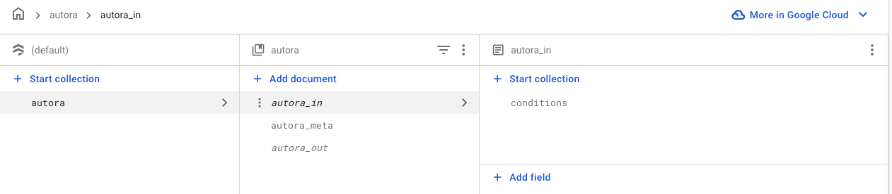

# Connect AutoRA WorkFlow to Firebase

After setting up a mechanism to deploy your experiments online, you can now connect the AutoRA workflow to Firestore database. This will allow us to update experiment conditions and to download observations collected from the experiment.


The workflow will manage the entire research process, from generating novel experiments to collecting data and modeling the results. 

Note that the workflow will talk to the Firebase project by uploading and downloading data to the Firestore database. We will upload new experiment conditions to the database and download the results of the experiment from it. 

The AutoRA workflow can be found in the `researcher_hub` folder, which contains a basic template for an AutoRA workflow integrated with `SweetBean`.


- Move into the `researcher_hub` directory, where the template for the workflow is stored.

```shell
cd researcher_hub
```

- Then install the Python packages required for the workflow using `pip`:

```shell
pip install -r requirements.txt
```

## Add Firebase Credentials

The AutoRA workflow (specifically the `autora-firebase-runner`) will need access to your firebase project. Therefore, we need the corresponding credentials. 

- To obtain the credentials, go to the [Firebase console](https://console.firebase.google.com/).
- Navigate to the project.
- Click on the little gear on the left and then select ``Project settings``. 
- Click on ``Service accounts``.

- Having ``Node.js`` selected, click ``Generate a new private key``. This should generate a json file that you can download.
- Open the file `autora_workflow.py` in the `researcher_hub`-folder and navigate to the part of the code that contains a placeholder for the credentials. It should look like this
```python
firebase_credentials = {
    "type": "type",
    "project_id": "project_id",
    "private_key_id": "private_key_id",
    "private_key": "private_key",
    "client_email": "client_email",
    "client_id": "client_id",
    "auth_uri": "auth_uri",
    "token_uri": "token_uri",
    "auth_provider_x509_cert_url": "auth_provider_x509_cert_url",
    "client_x509_cert_url": "client_x509_cert_url"
}
```
- Replace the placeholders with the credentials from the json file you downloaded.

## Try out the Workflow

- Within your environment, you can now run `python autora_workflow.py`
- Head over to your website to test your first online experiment. You can find the link in the [Firebase console](https://console.firebase.google.com/). Navigate to your project and select ``Hosting`` in the left navigation menu. The domain of your experiment is listed on top under ``Domains``.


There shouldn't be much happening with the web experiment. However, you can check whether the workflow is running correctly by looking at Firestore database. The workflow uploads experiment conditions to this database which should be visible.

- To check the database, go to the Firebase console and select your project. On the left menu, navigate to ``Firestore Database``. If everything worked, you should see database fields called ``autora_in`` and ``autora_out``. The former contains the experiment conditions which are used to configure the experiment. The latter will contain the results of the experiment.



## Next Steps

[Next: Add functions to automatically design and build a simple psychophysics experiment.](experiment.md)

