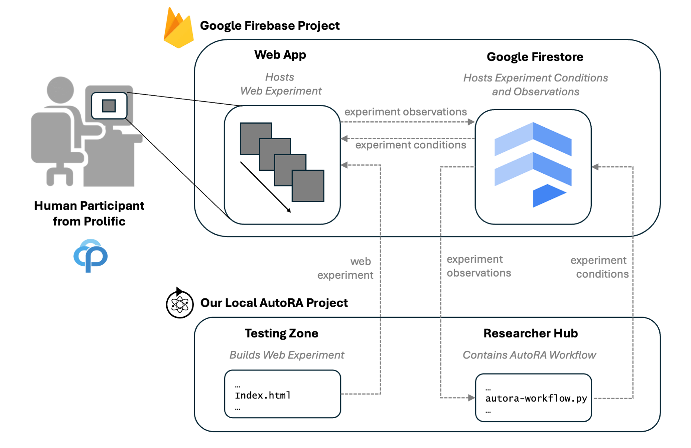

# Connect Project With Prolific

Once you have your closed-loop workflow set up, it is fairly easy to connect it to [Prolific](https://www.prolific.co/), 
a recruiting platform for web-based experiments. By connecting your project with Prolific via the `firebase-prolific-runner`, you can automatically recruit participants for your study and collect data from them. 



!!! hint:
The `firebase-prolific-runner` will automatically set up a study on Prolific and recruit participants. It is highly recommended to test the experiment before recruiting participants, to have approval from an ethics committee, and to adhere to the ethical guidelines.

## Prerequisites

- You have a [Prolific](https://www.prolific.co/) account.
- Your behavioral study is approved by an ethics committee or institutional review board (IRB).
- You have a corresponding consent form for your study.


## Add Consent Form to Experiment

Before you can connect your project with Prolific, you will likely need to add a consent form to your experiment. The consent form should be displayed to participants before they start the experiment.

One way of adding a consent form is to modify your web experiment. In this example we automatically generated a web experiment using ``SweetBean`` within the ``stimulus_sequence.py`` script in the ``researcher_hub`` folder. 

One way of adding the consent form would be to add a consent forme event:

```python
  consent_form = TextStimulus(text='Content of your consent form.<br><br> \
                                          Press the SPACE key to accept and continue.', 
                                    choices=[' '])
```

and add it to the instruction block:

```python
  introduction_list = [consent_form,
                       introduction_welcome, 
                       introduction_pictures, 
                       introduction_responses, 
                       introduction_note]
```

## Update AutoRA Workflow to Use Prolific

- Navigate to the ``autora_workflow.py`` file in the ``researcher_hub`` folder

- First, we want to add this import statement for the ``firebase_prolific_runner``:

```python
from autora.experiment_runner.firebase_prolific import firebase_prolific_runner
```

- Finally, all you need to do is to replace the following ``experiment_runner``  in the ``autora_workflow.py`` script:

```python
experiment_runner = firebase_runner(
    firebase_credentials=firebase_credentials,
    time_out=100,
    sleep_time=5)
```

with the following ``firebase_prolific_runner``:

```python
# Sleep time (seconds): The time between checks to the firebase database and updates of the prolific experiment
sleep_time = 30

# Study name: This will be the name that will appear on prolific.
# Participants that have participated in a study with the same name will be excluded.
study_name = 'my autora experiment'

# Study description: This will appear as study description on prolific
study_description= 'Psychophysics Study'

# Study Url: The url of your study (you can find this in the Firebase Console
study_url = 'https://closed-loop-study.web.app/'

# Study completion time (minutes): The estimated time a participant will take to finish your study. We use the compensation suggested by Prolific to calculate how much a participant will earn based on the completion time.
study_completion_time = 5

# Prolific Token: You can generate a token on your Prolific account
prolific_token = 'my prolific token'

# Completion code: The code a participant gets to prove they participated. If you are using the standard project set up (with cookiecutter), please make sure this is the same code that you have provided in the .env file of the testing zone. The code can be anything you want.
completion_code = 'my completion code'

experiment_runner = firebase_prolific_runner(
            firebase_credentials=firebase_credentials,
            sleep_time=sleep_time,
            study_name=study_name,
            study_description=study_description,
            study_url=study_url,
            study_completion_time=study_completion_time,
            prolific_token=prolific_token,
            completion_code=completion_code,
        )
```

- Make sure to update the input arguments above according to your configuration on Prolific and Firebase.

## Update .env in testing_zone (Optional)

The ``firebase_prolific_runner`` optimally allocates slots for the experiments you submit to Prolific. If you are done with testing, and are ready for data collection you may want to update the ``.env`` file in the ``testing_zone`` folder.

- Navigate to the ``testing_zone`` folder.
- Open the ``.env`` file.
- Set the ``REACT_APP_useProlificId`` variable to ``True``.
```shell
REACT_APP_useProlificId="True"
```

## Summary

- **This is it!** Running the ``autora_workflow.py`` in the ``researcher_hub`` should now result in closed-loop psychophysics study that recruits human participants from Prolific to participate in your web-based experiment hosted on Firebase.
