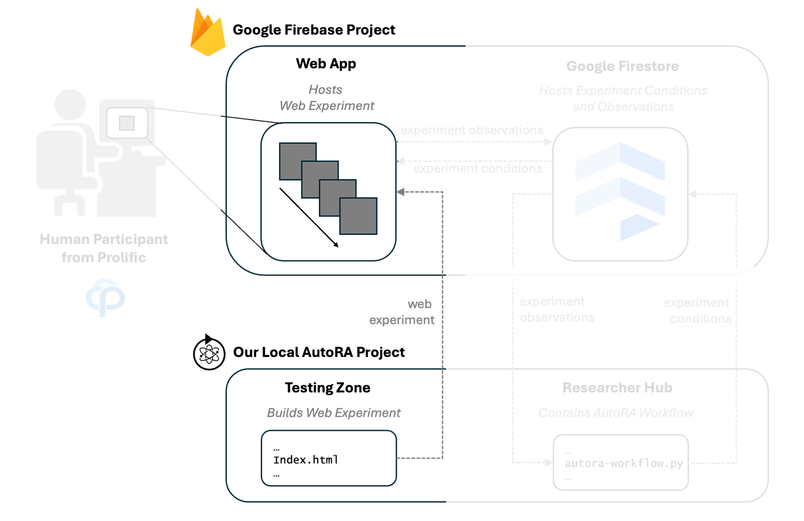
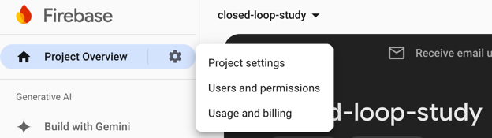
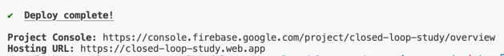

# Connect Project With Firebase

Next, we need to connect your project with Firebase, so we can deploy web experiments.



- Move to the `testing_zone` folder in your project (e.g., locally or on GitHub Codespaces). 

The `testing_zone` contains a basic template for a website that is compatible with the [AutoRA Experimentation Manager for Firebase](https://autoresearch.github.io/autora/user-guide/experiment-runners/experimentation-managers/firebase/) and the [AutoRA Recruitment Manager for Prolific](https://autoresearch.github.io/autora/user-guide/experiment-runners/recruitment-managers/prolific/).

## Copy Web App Credentials From Firebase

- Navigate to the [Firebase console](https://console.firebase.google.com/) and select the project you created.
- On the gear-symbol next to `Project Overview`, you can find `project settings`.

- You will find credentials in the tab `general` (you might have to scroll down). They should contain something like this
```javascript
// Your web app's Firebase configuration
const firebaseConfig = {
  apiKey: "AIzaadskKasjjasjKqsIt-UPXSDsdkdDhjBDU",
  authDomain: "closed-loop-study.firebaseapp.com",
  projectId: "closed-loop-study",
  storageBucket: "closed-loop-study.appspot.com",
  messagingSenderId: "338700008594",
  appId: "1:3328439208594:web:136f203fe48f63ea4b"
};
```
- Copy the credentials to the corresponding variables in the `.env` file in the `testing_zone` folder that was created on your system using create-react-app or cookiecutter. After you copied the credentials, it should look something like this:
```dotenv
REACT_APP_apiKey="AIzaadskKasjjasjKqsIt-UPXSDsdkdDhjBDU"
REACT_APP_authDomain="closed-loop-study.firebaseapp.com"
REACT_APP_projectId="closed-loop-study"
REACT_APP_storageBucket="closed-loop-study.appspot.com"
REACT_APP_messagingSenderId="338700008594"
REACT_APP_appId="1:3328439208594:web:136f203fe48f63ea4b"
REACT_APP_devNoDb="True"
REACT_APP_useProlificId="False"
REACT_APP_completionCode="complete"
```

- For now, we will leave ``REACT_APP_useProlificId="False"``. We will change these later when we set up the Prolific integration.

## Configure Your Project For Firebase

- ***!!! IMPORTANT !!!*** Make sure to ``cd`` into the `testing_zone` folder in your terminal.

- In the `testing_zone` folder, enter the following commands in your terminal:
First log in to your Firebase account using

```shell
firebase login
```
or (if you run this in codespace)
```shell
firebase login --no-localhost
```

- If asked to collect CLI and Emulator Suite usage information, you can choose to answer yes or no.

!!! hint
    You may be asked to authenticate. Follow the instructions in your terminal to authenticate your account. This will require following a link that requires you to sign in with your Google account. Once you selected a Google account. Follow the setup and allow Firebase CLI access. Click ``Yes, I just ran this command.`` Assuming this is your session ID, click ``Yes, this is my session ID``. Next, you are taken to a long string that you can copy into the terminal. It should look something like this: `2/0AVGKJADKHAXKg4ML_Usub28sdhjdskjsdktwWeAJASKFCjrKMck-SBEfgsddDmKQlfrDSQ`. 

- Initialize the Firebase project in the `testing_zone` folder by running:
```shell
firebase init
```
- An interactive initialization process will now run in your command line. You can select options with SPACE and confirm your selection with ENTER.

  1. For the first question, select the following options. Once you selected both options, press ENTER.

  - `Firestore: Configure security rules and indexes files for Firestore`
  - `Hosting: Configure files for Firebase Hosting and (optionally) set up GitHub Action deploys`

  2. Select `use an existing project`. Press ENTER.
  3. Select the project you created earlier. You should recognize it by the project name you entered when setting up Firebase. Press ENTER.
  4. Confirm the default option `(firestore.rules)` with ENTER. 
  5. Confirm the default option `((firestore.indexes.json))` with ENTER.
  6. ***!!! IMPORTANT !!!*** Use the build directory instead of the public directory here. Enter `build` and press ENTER.
  7. Configure as a single-page app. Enter `y` and press ENTER.
  8. Don't set up automatic builds and deploys with GitHub. Enter `N` and press ENTER. 
  9. Don't overwrite the index.html file if the question pops up.

## Install sweetbean
- Next, we install sweetbean (still within the ``testing_zone`` folder):
```shell
npm install sweetbean
```

## Build And Deploy To Firebase 
The testing zone folder already contains a default web-based experiment. To serve this web-experiment on the internet, you must build and deploy it to Firebase. We will repeat this step later once we deploy our actual experiment.

- To build the experiment, run
```shell
npm run build
```
- To deploy the experiment to Firebase, run
```shell
firebase deploy
```
If everything worked, you should see something like this:


This includes a link to your web-based experiment. You can now open this link in your browser. However, at this moment, we haven't built an experiment yet, so you will see nothing interesting. Next, we will set up the AutoRA workflow and generate the experiment.

## Next Steps

[Next: Initialize your AutoRA workflow in the researcher hub.](init-autora.md)
