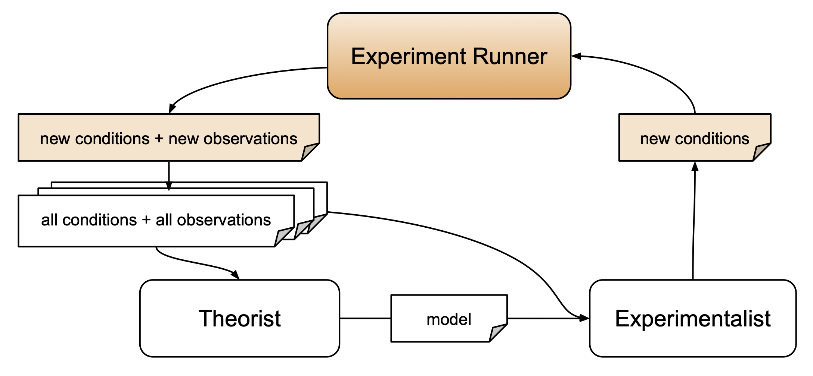

# Experiment Runner Overview

AutoRA includes tools for running synthetic and real-world experiments.

For synthetic experiments, these tools consist of ground-truth models from various disciplines that can be used to generate synthetic data. For real-world experiments, these tools consist of (i) experimentation managers, (ii) recruitment managers, and (iii) experiment runners, which combine experimentation managers with recruitment managers. Experimentation managers facilitate communication of conditions and observations between AutoRA and environments in which experiments are hosted. Recruitment managers facilitate recruitment and coordination of study participants.

Experiment runner tools may take in information about new experimental conditions or entire experiments. The following table includes the various experiment runner tools currently implemented in AutoRA.

| Name                                  | Links                                                                                                                                                                                                          | Description                                                                                                                                                     |
|---------------------------------------|----------------------------------------------------------------------------------------------------------------------------------------------------------------------------------------------------------------|-----------------------------------------------------------------------------------------------------------------------------------------------------------------|
| Synthetic                             | [Package](https://pypi.org/project/autora-synthetic/), [Docs](https://autoresearch.github.io/autora/user-guide/experiment-runners/synthetic/)                                                                  | A compendium of ground-truth models across psychology, psychophysics, behavioral economics, and other disciplines.                                              |
| Firebase (experimentation manager)    | [Package](https://pypi.org/project/autora-experiment-runner-experimentation-manager-firebase/), [Docs](https://autoresearch.github.io/autora/user-guide/experiment-runners/experimentation-managers/firebase/) | An experimentation manager that provides functionality to manage communication of conditions and observations between AutoRA and an experiment on Firebase.     |
| Prolific (recruitment manager)        | [Package](https://pypi.org/project/autora-experiment-runner-recruitment-manager-prolific/), [Docs](https://autoresearch.github.io/autora/user-guide/experiment-runners/recruitment-managers/prolific/)         | A recruitment manager that provides functionality to recruit participants via Prolific to conduct an experiment using AutoRA.                                   |
| Firebase-Prolific (experiment runner) | [Package](https://pypi.org/project/autora-experiment-runner-firebase-prolific/), [Docs](https://autoresearch.github.io/autora/user-guide/experiment-runners/firebase-prolific/)                                | An experiment runner that combines the Firebase experimentation manager and the Prolific recruitment manager to automatically run human behavioral experiments. |

