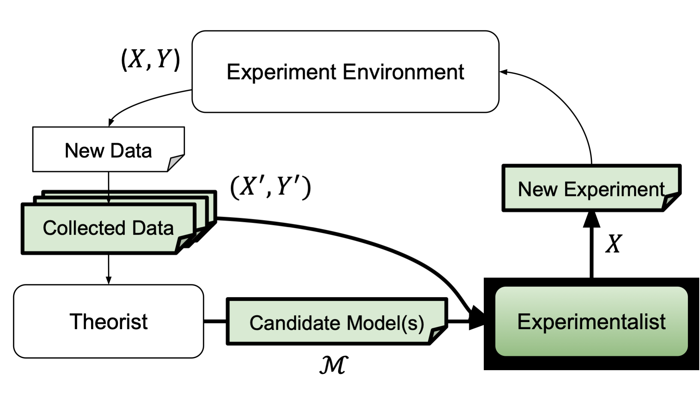

# Experimentalist Overview

The primary goal of an experimentalist is to identify experiments that yield 
scientific merit. AutoRA implements techniques for automating the identification 
of novel experiments.

An experiment consists of a series of **experimental conditions** $\vec{x} \in X$. 
The experimental variables manipulated in each experimental condition 
are defined as **factors**, and the values of each variable to be sampled 
in the experiment are defined as **levels** of the corresponding **factors**. 
As an example, consider a visual discrimination tasks in which participants are presented
with two lines of different lengths, and are asked to indicate which line is longer.
There are two factors in this experiment: the length of the first line and 
the length of the second line. Instances of the two line lengths 
(e.g., 2.0 cm for the first line and 2.1 cm for the second line) 
can be considered levels of the two factors, respectively. Thus, *an experimental condition is a vector of values that
corresponds to a specific combination of experiment levels $x_i$, 
each of which is an instance of an experiment factor.*

Experimentalists in AutoRA serve to identify novel 
experimental conditions $\vec{x} \in X$, where $x_i$ corresponds 
to the level of an experimental factor $i$.

Experimentalists may use information about candidate models $M$ obtained from a theorist, 
experimental conditions that have already been probed $\vec{x}' \in X'$, or 
respective dependent measures $\vec{y}' \in Y'$. The following table includes the experimentalists currently implemented
 in AutoRA.

| Name               | Links                                                                                                                                                                                          | Description                                                                                                                                                                                                                                                          | Arguments   |
|--------------------|------------------------------------------------------------------------------------------------------------------------------------------------------------------------------------------------|----------------------------------------------------------------------------------------------------------------------------------------------------------------------------------------------------------------------------------------------------------------------|-------------|
| Random             | [Package](https://pypi.org/project/autora-core/), [Docs](https://autoresearch.github.io/autora/core/docs/experimentalists/sampler/random/)                                                     | An experimentalist with pooling and sampling functionality. The pooler creates combinations of conditions from lists of discrete values using random selection; the sampler draws from a pool of conditions without replacement using uniform random sampling.       |             |
| Novelty            | [Package](https://pypi.org/project/autora-experimentalist-sampler-novelty/), [Docs](https://autoresearch.github.io/autora/user-guide/experimentalists/samplers/novelty/)                       | A sampler that identifies experimental conditions $\vec{x}' \in X'$ with respect to a pairwise distance metric applied to existing conditions $\vec{x} \in X$.                                                                                                       | $X'$        |
| Uncertainty        | [Package](https://pypi.org/project/autora-experimentalist-sampler-uncertainty/), [Docs](https://autoresearch.github.io/autora/user-guide/experimentalists/samplers/uncertainty/)               | A sampler that identifies experimental conditions $\vec{x}' \in X'$ with respect to model uncertainty, which can be calculated in three different ways.                                                                                                              | $M$         |
| Model Disagreement | [Package](https://pypi.org/project/autora-experimentalist-sampler-model-disagreement/), [Docs](https://autoresearch.github.io/autora/user-guide/experimentalists/samplers/model-disagreement/) | A sampler that identifies experimental conditions $\vec{x}' \in X'$ with respect to a pairwise distance metric between theorist models, $P_{M_{i}}(\hat{y}, \vec{x}')$.                                                                                              | $M$         |
| Falsification      | [Package](https://pypi.org/project/autora-experimentalist-falsification/), [Docs](https://autoresearch.github.io/autora/falsification/docs/sampler/)                                           | An experimentalist with pooling and sampling functionality which generates and samples from novel experimental conditions under which the loss $\hat{\mathcal{L}}(M,X,Y,X')$ of the best candidate model is predicted to be the highest.                             | $M, X', Y'$ |
| Mixture            | [Package](https://pypi.org/project/mixture-experimentalist/), [Docs](https://autoresearch.github.io/autora/user-guide/experimentalists/samplers/mixture/)                                      | A sampler that uses a mixture of specified sampling strategies to identify novel experimental conditions. Conditions are selected based on a weighted sum of scores obtained from the specified strategies.                                                          | $M, X', Y'$ |
| Nearest Value      | [Package](https://pypi.org/project/autora-experimentalist-sampler-nearest-value/), [Docs](https://autoresearch.github.io/autora/user-guide/experimentalists/samplers/nearest-value/)           | A sampler which returns the nearest values between the input samples and the allowed values, without replacement.                                                                                                                                                    | $X'$        |
| Leverage           | [Package](https://pypi.org/project/autora-experimentalist-sampler-leverage/), [Docs](https://autoresearch.github.io/autora/user-guide/experimentalists/samplers/leverage/)                     | A sampler that identifies experimental conditions using the statistical concept of leverage to refit candidate models iteratively with the leave-one-out method.                                                                                                     | $M$         |
| Inequality         | [Package](https://pypi.org/project/autora-experimentalist-sampler-inequality/), [Docs](https://autoresearch.github.io/autora/user-guide/experimentalists/samplers/inequality/)                 | A sampler that uses a pairwise distance metric to compare and select new experimental conditions. This metric along with a difference threshold are used to calculate inequality scores for candidate conditions, and conditions with the highest scores are chosen. | $X'$        |
