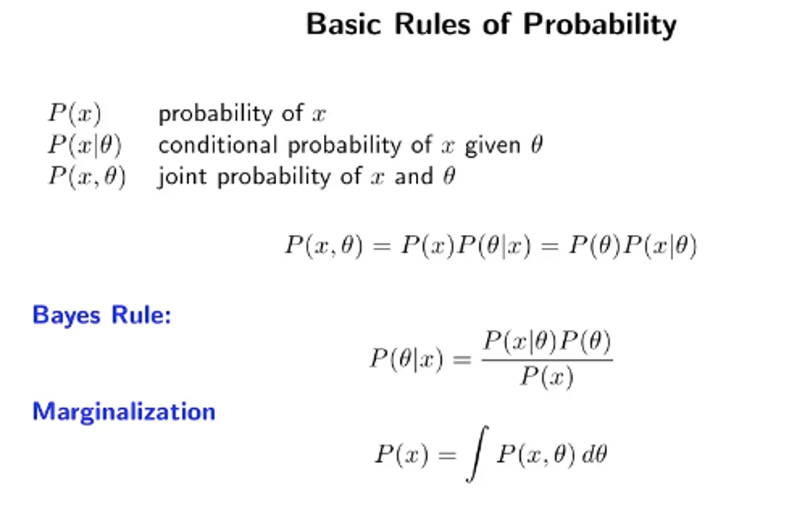
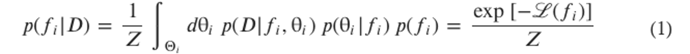
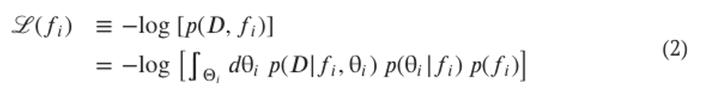
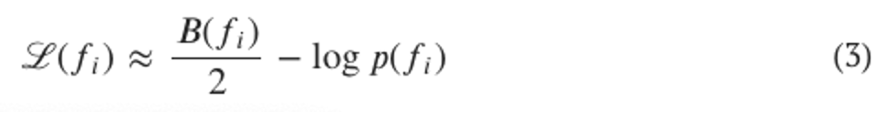

# Bayesian Machine Scientist

## How it works

The Bayesian Machine Scientist (BMS) utilizes Bayesian Statistical Theory to more effectively search the space of possible equations:

In essence, prior knowledge is incorporated with current knowledge to better predict future knowledge, and hence, better fit on the current data.

BMS utilizes this theory:

1) Formulating the problem of fitting an equation to data, with priors over equations found on wikipedia:

2) Deriving a Loss Function to score different equations - defined as the description length of the model, which is the number of nats needed to jointly encode the data and the model with an optimal code:

3) Finding a computationally tractable approximation for the Loss Function:

In this formulation, the goodness of fit $p(D|\theta^\*,f_i)$ and likelihood $p(f_i)$ of an equation are equally and logarithmically weighted to each other - e.g. improving the fit by a factor of 2 is offset by being half as likely.

To better understand the problem, equations are framed in terms of acyclic (tree) graphs.

Bayesian Theory is then applied to navigating the search space. BMS employs a popular sampling method to do this efficiently.

The search space is very rugged, and local minima are difficult to escape. BMS employs a parallel tempering approaching to overcome this.

A step in the search space involves two steps

I) Markov Chain Monte Charlo (Metropolitan) Sampling:

    a) One of three mutations - Root Removal/Addition, Elementary Tree Replacement, Node Replacement - are selected for the equation tree.
    b) Choosing the operator associated with the mutation relies on how likely the operator is to turn up (encoded in the priors).
    c) Choosing a specific variable or parameter value is random.
    d) Following through with the mutation depends on passing the Metropolitan accept condition.
    

II) Parallel Tree Swap:

    a) Two trees held at parallel temperatures are selected.
    b) The temperatures of the two trees are swapped.
    c) If this improves/lowers the loss of the now colder tree, the tree temperatures are permanently swapped.
    d) If not, the trees are put back to normal.
    
After iterating over these two steps for $n$ epochs, the tree held at the lowest temperature is returned as the fitted model
