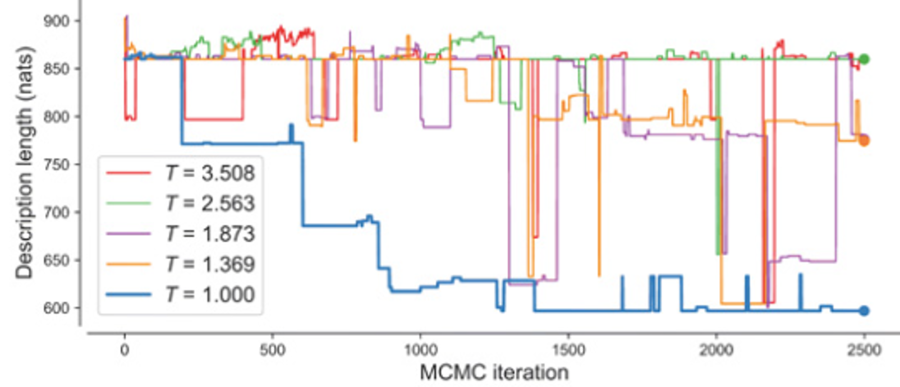
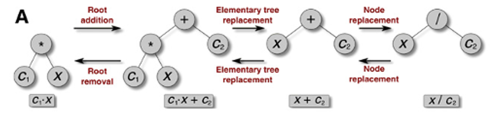

# Bayesian Machine Scientist

## How it works

The Bayesian Machine Scientist (BMS) uses Bayesian probability to search the space of possible equations. The following are the relevant quantities in this Bayesian approach:

- $P(x):$ Probability of $x$
- $P(x|\theta)$: Conditional Probability of $x$ given $\theta$
- $P(x,\theta)$: Joint Probability of $x$ and $\theta$

Mathematically, we know:

$P(x,\theta)=P(x)P(\theta|x)=P(\theta)P(x|\theta)$

Bayes Rule, which just rearranges the expression above, states the following:

$P(\theta|x)=\dfrac{P(x|\theta)P(\theta)}{P(x)}$

Here, $P(\theta)$ is the prior probability, $P(x|\theta)$ is the probability of data given the prior (also known as the 'likelihood'), $P(x)$ is the probability of the data marginalized over all possible values of \theta, and P(\theta|x) is the posterior probability. 

In essence, prior knowledge $P(/theta)$ is combined with evidence $P(x|\theta)$ to arrive at better knowledge $P(\theta|x). 

BMS capitalizes on this process for updating knowledge:

1) It formulates the problem of fitting an equation to data by first specifying priors over equations found on wikipedia:

$P(f_i|D)=\dfrac{1}{Z}\int_{\Theta_i}P(D|f_i,\theta_i)P(\theta_i|f_i)P(f_i)d\theta_i$

With $Z=P(D)$ being a constant for a given dataset - we can ignore it since we are only interested in finding the best equation within the context of the data at hand.

2) It then scores different candidate equations using description length as a loss function. Formally, this description length is the number of natural units of information (nats) needed to jointly encode the data and the equation optimally.

$\mathscr{L}(f_i)\equiv-\log\[P(D,f_i)\]=-\log\[P(f_i|D)P(D)\]=-\log\[\int_{\Theta_i}P(D|f_i,\theta_i)P(\theta_i|f_i)P(f_i)d\theta_i\]$

3) Since the loss function is computationally intractable, it uses an approximation:

$\mathscr{L}(f_i)\approx\dfrac{B(f_i)}{2} - \log\[P(f_i)\]$

where $B(f_i)=k\log\[n\] - 2\log\[P(D|\theta^\*,f_i)\]$

In this formulation, the goodness of fit $p(D|\theta^\*,f_i)$ and likelihood $p(f_i)$ of an equation are equally and logarithmically weighted to each other - e.g., improving the fit by a factor of 2 is offset by having half the likelihood.

To better understand the problem, equations are framed in terms of acyclic graphs (i.e., trees)

Bayesian Theory is then applied to navigating the search space. BMS employs a popular sampling method (MCMC) to do this efficiently.

The search space is very rugged, and local minima are difficult to escape, so BMS employs parallel tempering to overcome this.

One incremental unit of search in this approach involves two steps:

I) Markov Chain Monte Carlo Sampling:

    a) One of three mutations - Root Removal/Addition, Elementary Tree Replacement, Node Replacement - are selected for the equation tree.
    b) Choosing the operator associated with the mutation relies on how likely the operator is to turn up (encoded in the priors).
    c) Choosing a specific variable or parameter value is random.
    d) Accepting or rejecting the mutation depends on Metropolis' rule.
    

II) Parallel Tree Swap:

    a) Two parallel trees held at different temperatures are selected.
    b) The temperatures of the two trees are swapped.
    c) If this improves/lowers the loss of the now colder tree, the tree temperatures are permanently swapped.
    d) If not, the trees are reverted to preexisting temperatures.
    
After iterating over these two steps for $n$ epochs, the tree held at the lowest temperature is returned as the fitted model.

## References

R. Guimerà et al., A Bayesian machine scientist to aid in the solution of challenging scientific problems. Sci. Adv.
6, eaav697 (2020).
Wit, Ernst; Edwin van den Heuvel; Jan-Willem Romeyn (2012).
