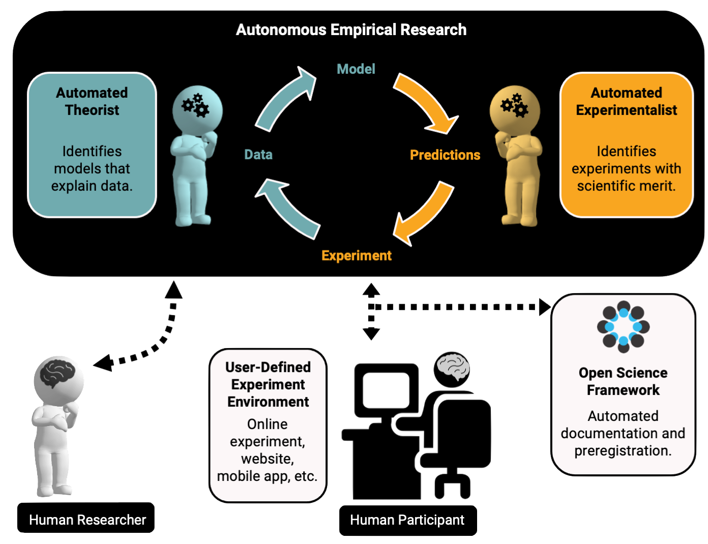

# Automated Research Assistant

<b>[AutoRA](https://pypi.org/project/autora/)</b> (<b>Auto</b>mated <b>R</b>esearch <b>A</b>ssistant) is an open-source framework for 
automating multiple stages of the empirical research process, including model discovery, experimental design, data collection, and documentation for open science.

AutoRA implements the <b>Autonomous Empirical Research Paradigm</b>, which involves a dynamic interplay
between two artificial agents. The first agent, a theorist, is primarily responsible for constructing 
computational models by relying on existing data to link experimental conditions to dependent measures. 
The second agent, an experimentalist, is tasked with designing follow-up
experiments that can refine and validate the models generated by the theorist. Together, these agents
implement an automated scientific discovery process. To enable closed-loop empirical research, AutoRA 
interfaces with platforms for automated data collection, such as Prolific or Amazon Mechanical Turk, 
which enable the efficient acquisition of behavioral data from human participants. Finally, AutoRA 
is designed to support the automated documentation and dissemination of steps in the empirical research process.

AutoRA was initially intended for accelerating research in the behavioral and brain sciences. 
However, AutoRA is designed as a general framework that enables automation of research processes in
other empirical sciences, such as materials science or physics.

## Features

AutoRA consists of different modules that can be used independently or in combination, such as:

- [**Theorists**](theorist/index.md) that support the discovery of formal scientific models from data
- [**Experimentalists**](experimentalist/index.md) that support the design of follow-up experiments
- [**Experiment runners**](experiment-runner/index.md) that support data collection from experimentation platforms (e.g., Prolific or Amazon Mechanical Turk)
- [**Workflow logic**](user-guide/workflow) for defining interactions between different components of the research process
- <b>Interfaces for automated documentation</b> of the research process

## Uses

AutoRA can be used for a variety of research purposes in empirical sciences, such as psychology, 
neuroscience, economics, physics, or materials science. Usages, as illustrated in the following tutorials, include:

- **Equation discovery** from empirical data
    - Example: [Theorist Tutorial](tutorials/basic/Tutorial%20Ia%20Theorists.ipynb).
- **Experimental design** for follow-up experiments
    - Example: [Experimentalist Tutorial](tutorials/basic/Tutorial%20Ib%20Experimentalists.ipynb).
- **Closed-loop empirical research**
    - Example: [Closed-Loop Psychophysics Study Tutorial](examples/closed-loop-basic/index.md).
- **Research documentation and dissemination**
- **Computational analyses of the scientific process** (metascience, computational philosophy of science)

## Motivation

The pace of empirical research is constrained by the rate at which scientists can alternate between the development of formal theories and the execution of experiments. However, attempts to increase this rate often compromise scientific rigor, leading to deficiencies such as the absence of formal modeling, non-replicable findings, and insufficient documentation. In order to surmount these limitations, we aim to develop AutoRA––an open-source framework that automates the generation, estimation, and empirical testing of scientific models. By automating steps of the empirical research process, we hope AutoRA can accelerate scientific discovery while promoting greater transparency and rigor in empirical research.

## How to Get Started?

We recommend that you have a look at the [Basic Tutorials](tutorials/index.md) to get started with AutoRA. These tutorials provide a step-by-step guide on how to set up a basic AutoRA workflow, including the creation of a theorist, experimentalist, and experiment runner.

Once you are familiar with the basics, you can explore the [Use Case Tutorials](examples/index.md) to see how AutoRA can be used for different real-world research purposes. We recommend the [Closed-Loop Psychophysics Study](examples/closed-loop-basic/index.md) as a starting point for understanding how AutoRA can be used for closed-loop behavioral research.

## Pointers

- [AutoRA Pip Package](https://pypi.org/project/autora/)
- [GitHub Repository](https://github.com/AutoResearch/autora)
- [Autonomous Empirical Research Group](http://www.empiricalresearch.ai)

## About

<a href="https://ccbs.carney.brown.edu/brainstorm"></img></a>&nbsp;&nbsp;&nbsp;&nbsp;
<a href="https://schmidtsciencefellows.org/"></img></a>

This project is in active development by the [Autonomous Empirical Research Group](https://musslick.github.io/AER_website/Research.html).

The development of this package was supported by [Schmidt Science Fellows](https://schmidtsciencefellows.org/), in partnership with the Rhodes Trust, as well as the [Carney BRAINSTORM program](https://ccbs.carney.brown.edu/brainstorm) at Brown University. The development of auxiliary packages for AutoRA, such as `autodoc`, is supported by [Schmidt Sciences, LLC. and the Virtual Institute for Scientific Software (VISS)](https://www.schmidtsciences.org/viss/). The AutoRA package was developed using computational resources and services at the [Center for Computation and Visualization at Brown University](https://ccv.brown.edu).

