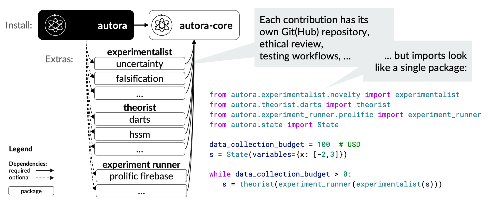

# Installation Guide

To install and use AutoRA you need:

- `Python` (version ">=3.8,<4") and
- the `autora` package, including required dependencies specified in the [`pyproject.toml` file](https://github.com/AutoResearch/autora/blob/main/pyproject.toml).

## Step 1: Install `python`

You can install `python`:

- Using the instructions at [python.org](https://www.python.org), or
- Using a package manager, e.g.
  [homebrew](https://docs.brew.sh/Homebrew-and-Python), 
  [pyenv](https://github.com/pyenv/pyenv),
  [asdf](https://github.com/asdf-community/asdf-python), 
  [rtx](https://github.com/jdxcode/rtx/blob/main/docs/python.md),
  [winget](https://winstall.app/apps/Python.Python.3.8).

If successful, you should be able to run python in your terminal emulator like this:
```shell
python
```

...and see some output like this:
```
Python 3.11.3 (main, Apr  7 2023, 20:13:31) [Clang 14.0.0 (clang-1400.0.29.202)] on darwin
Type "help", "copyright", "credits" or "license" for more information.
```
## Step 2: Install `autora`

We recommended using a `Python` environment manager like `virtualenv`. You may refer to the Development Guide on how to [set up a virtual environment](https://autoresearch.github.io/autora/contribute/setup/#create-a-virtual-environment).  

Before installing the PyPI ``autora`` package, you may [activate your environment](https://autoresearch.github.io/autora/contribute/setup/#activating-and-using-the-environment). To install the PyPI `autora` package, run the following command:

```shell
pip install "autora"
```

Check your installation by running:
```shell
python -c "from autora.variable import VariableCollection"
```

In using AutoRA, it is helpful to be aware of its structure, which is described next.


## Step 3: Install Optional Dependencies

``autora`` is organized into one "parent" and many "child" packages.



The ``autora`` "parent" package depends on core packages, such as [`autora-core`](https://github.com/autoresearch/autora-core) and [`autora-synthetic`](https://github.com/autoresearch/autora-synthetic), which are automatically installed with ``autora``. 

However, the ``autora`` ecosystem also includes vetted modules (child packages) as **optional dependencies** which users can choose to install. Below, we provide a list of all optional dependencies that are currently vetted by the ``autora`` core team.


To install any (combination) of optional dependencies, users should run the relevant analogue of the following command, with the name in brackets matching the name as specified in the parent `pyproject.toml` file:

```shell
pip install -U "autora[desired-dependency]"
```

For example, to install one of the [Theorists](theorist/index.md), such as the Bayesian Machine Scientist (BMS) from the package `autora-theorist-bms`, a user should run:

```shell
pip install -U "autora[theorist-bms]"
```

To check that installation was successful, a user can try importing one of the main classes of the corresponding child package. For BMS, such a check would be:
```shell
python -c "from autora.theorist.bms import BMSRegressor; BMSRegressor()"
```

### List of Vetted Dependencies

For a complete list of dependencies that have been vetted by the core ``autora`` team, see the `[project.optional-dependencies]` section of the [`pyproject.toml` file](https://github.com/AutoResearch/autora/blob/main/pyproject.toml) in the parent `autora` package.
For your convenience, we provide a list of vetted packages along with their description below. 

**Required dependencies** are included in the installation of the ``autora`` package.
**Optional dependencies** must be separately installed as outlined above.

| Dependency Name                                         | Dependency Type | Feature Type                               | Brief Description                                                                                                                                                                              | Documentation                                                                                                                                 |
|------------------------------------------------------------------|-----------------|--------------------------------------------|------------------------------------------------------------------------------------------------------------------------------------------------------------------------------------------------|-----------------------------------------------------------------------------------------------------------------------------------------------|
| [theorist-bms](https://pypi.org/project/autora-theorist-bms/)    | Optional        | Theorist                                   | Equation Discovery Method Using the Bayesian Machine Scientist ([Guimerà et al. 2020](https://www.science.org/doi/full/10.1126/sciadv.aav6971))                                                | [🔗](https://autoresearch.github.io/autora/user-guide/theorists/bms/)                                                                         |
| [theorist-bsr](https://pypi.org/project/autora-theorist-bsr/)    | Optional        | Theorist                                   | Equation Discovery Method Using the Bayesian Symbolic Regression ([Jin et al. 2020](https://arxiv.org/abs/1910.08892))                                                                         | [🔗](https://autoresearch.github.io/autora/user-guide/theorists/bsr/)                                                                         |
| [theorist-darts](https://pypi.org/project/autora-theorist-darts/) | Optional        | Theorist                                   | Equation Discovery Method using Differentiable Architecture Search ([Liu et al., 2018](https://arxiv.org/abs/1806.09055); [Musslick et al., 2020](https://escholarship.org/uc/item/9wd571ts) ) | [🔗](https://autoresearch.github.io/autora/user-guide/theorists/darts/)                                                                       |
| [experimentalist-falsification](https://pypi.org/project/autora-experimentalist-falsification/) | Optional        | Experimentalist          | Identifies experimental conditions method that maximize predicted model loss ([Musslick et al., 2023](https://escholarship.org/content/qt5ch569fg/qt5ch569fg.pdf))                             | [🔗](https://autoresearch.github.io/autora/user-guide/experimentalists/falsification/) |
| [experimentalist-inequality](https://pypi.org/project/autora-experimentalist-inequality/) | Required        | Experimentalist                  | Identifies experimental conditions from a candidate pool based on their inequality to a reference pool                                                                                         | [🔗](https://autoresearch.github.io/autora/user-guide/experimentalists/inequality/) |
| [experimentalist-mixture](https://pypi.org/project/mixture-experimentalist/) | Required        | Experimentalist                  | Identifies experimental conditions based on a weighted score of multiple experimentalists.                                                                                                     | [🔗](https://autoresearch.github.io/autora/user-guide/experimentalists/mixture/) |
| [experimentalist-model-disagreement](https://pypi.org/project/autora-experimentalist-model-disagreement/) | Required        | Experimentalist                   | Identifies experimental conditions for which a list of models make different predictions                                                                                                       | [🔗](https://autoresearch.github.io/autora/user-guide/experimentalists/model-disagreement/) |
| [experimentalist-nearest-value](https://pypi.org/project/autora-experimentalist-nearest-value/) | Required        | Experimentalist                  | Identifies experimental conditions from a candidate pool that are nearest to experimental conditions in a reference pool.                                                                      | [🔗](https://autoresearch.github.io/autora/user-guide/experimentalists/inequality/) |
| [experimentalist-novelty](https://pypi.org/project/autora-experimentalist-novelty/) | Required        | Experimentalist                  | Identifies experimental conditions from a candidate pool that are most novel with respect to a reference pool.                                                                                 | [🔗](https://autoresearch.github.io/autora/user-guide/experimentalists/novelty/) |
| [experimentalist-uncertainty](https://pypi.org/project/autora-experimentalist-uncertainty/) | Optional        | Experimentalist                  | Identifies experimental conditions based on uncertainty sampling.                                                                                                                              | [🔗](https://autoresearch.github.io/autora/user-guide/experimentalists/uncertainty/) |
| [autora-experiment-runner-firebase-prolific](https://pypi.org/project/autora-experiment-runner-firebase-prolific/) | Optional        | Experiment Runner    | This experiment runner provides functionality for running behavioral experiments hosted on Firebase using human participants from Prolific.                                                    | [🔗](https://autoresearch.github.io/autora/user-guide/experiment-runners/firebase-prolific/) |
| [experiment-runner-experimentation-manager-firebase](https://pypi.org/project/autora-experiment-runner-experimentation-manager-firebase/) | Optional        | Experiment Runner (Experimentation Manager) | This manager provides functionality to manage communication of conditions and observation between AutoRA and a behavioral experiment hosted on Firebase.                                       | [🔗](https://autoresearch.github.io/autora/user-guide/experiment-runners/experimentation-managers/firebase/) |
| [autora-experiment-runner-recruitment-manager-prolific](https://pypi.org/project/autora-experiment-runner-recruitment-manager-prolific/) | Optional        | Experiment Runner (Recruitment Manager)    | This manager provides functionality for recruiting human participants from Prolific.                                                                                                           | [🔗](https://autoresearch.github.io/autora/user-guide/experiment-runners/recruitment-managers/prolific/) |

### List of Bundled Dependencies


``autora`` also provides the ability to install some of these optional dependencies in a bundle. These bundles can also be found in the `[project.optional-dependencies]` section of the [`pyproject.toml` file](https://github.com/AutoResearch/autora/blob/main/pyproject.toml) in the parent `autora` package.

You can install these bundles just like any other package. For example, to install the ``all-theorists`` bundle:

```shell
pip install -U "autora[all-theorists]"
```

For your convenience, we provide a list of vetted bundled packages and what components they include below.


| Bundle Name | Components Included |
|---|---|
|all|The theorist, experimentalist, and experiment runner bundles|
|all-theorists| [theorist-bms](https://pypi.org/project/autora-theorist-bms/), [theorist-bsr](https://pypi.org/project/autora-theorist-bsr/), [theorist-darts](https://pypi.org/project/autora-theorist-darts/)|
|all-experimentalists| [experimentalist-falsification](https://pypi.org/project/autora-experimentalist-falsification/), [experimentalist-inequality](https://pypi.org/project/autora-experimentalist-inequality/), [experimentalist-mixture](https://pypi.org/project/mixture-experimentalist/), [experimentalist-model-disagreement](https://pypi.org/project/autora-experimentalist-model-disagreement/), [experimentalist-nearest-value](https://pypi.org/project/autora-experimentalist-nearest-value/), [experimentalist-novelty](https://pypi.org/project/autora-experimentalist-novelty/), [experimentalist-uncertainty](https://pypi.org/project/autora-experimentalist-uncertainty/)|
all-experiment_runners | [autora-experiment-runner-firebase-prolific](https://pypi.org/project/autora-experiment-runner-firebase-prolific/)|
all-experiment-runner-experimentation-managers|[experiment-runner-experimentation-manager-firebase](https://pypi.org/project/autora-experiment-runner-experimentation-manager-firebase/)|
all-experiment-runner-recruitment-managers|[autora-experiment-runner-recruitment-manager-prolific](https://pypi.org/project/autora-experiment-runner-recruitment-manager-prolific/)


