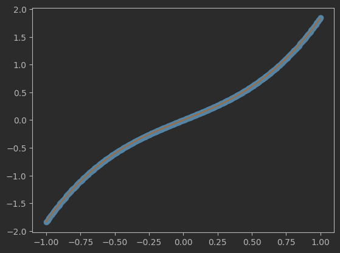

# Bayesian Symbolic Regression

## Example

The following toy example shows out-of-the-box functionality of BSR. It first generates data using the equation, $y = \sin(x) + x^3$, as ground-truth, and then fits the data with default meta-parameters. For ease and efficiency of illustration, it applies a small number of iterations, `itr_num`. As displayed in the plot below, the algorithm provides results that are not only reasonable, but exactly match the ground-truth equation.

```python
from autora_bsr.skl.bsr import BSRRegressor
import numpy as np
import matplotlib.pyplot as plt

x = np.expand_dims(np.linspace(start=-1, stop=1, num=500), 1)
# y = x^3 + sin(x)
y = np.power(x, 3) + np.sin(x)

# initialize regressor
bsr = BSRRegressor(itr_num = 500)
bsr.fit(x, y)
y_pred = bsr.predict(x)

# plot out the ground truth versus predicted responses
plt.figure()
plt.plot(x, y, "o")
plt.plot(x, y_pred, "-")
plt.show()
```


