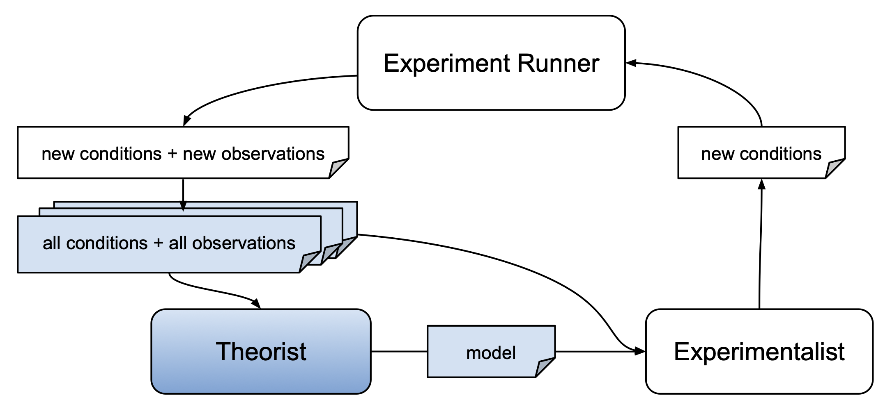

# Theorist Overview

AutoRA consists of a set of techniques designed to automate the construction of interpretable models from data. To approach this problem, we can consider computational models as small, interpretable [computation graphs](https://medium.com/tebs-lab/deep-neural-networks-as-computational-graphs-867fcaa56c9) (see also [Musslick, 2021](https://arxiv.org/abs/2103.13939)). A computation graph can take experiment parameters as input (e.g. the brightness of a visual stimulus) and can transform this input through a combination of functions to produce observable dependent measures as output (e.g. the probability that a participant can detect the stimulus).

Theorist use information about experimental conditions that have already been probed $\vec{x}' \in X'$ and 
respective dependent measures $\vec{y}' \in Y'$. The following table includes the theorists currently implemented in AutoRA.

| Name                                       | Links                                                                                                                                 | Description                                                                                                                                                                       | Arguments |
|--------------------------------------------|---------------------------------------------------------------------------------------------------------------------------------------|-----------------------------------------------------------------------------------------------------------------------------------------------------------------------------------|-----------|
| Differentiable Architecture Search (DARTS) | [Package](https://pypi.org/project/autora-theorist-darts/), [Docs](https://autoresearch.github.io/autora/user-guide/theorists/darts/) | A theorist that automates the discovery of neural network architectures by making architecture search amenable to gradient descent.                                               | $X', Y'$  |
| Bayesian Machine Scientist (BMS)           | [Package](https://pypi.org/project/autora-theorist-bms/), [Docs](https://autoresearch.github.io/autora/user-guide/theorists/bms/)     | A theorist that uses one algorithmic Bayesian approach to symbolic regression, with the aim of discovering interpretable expressions which capture relationships within data.     | $X', Y'$  |
| Bayesian Symbolic Regression (BSR)         | [Package](https://pypi.org/project/autora-theorist-bsr/), [Docs](https://autoresearch.github.io/autora/user-guide/theorists/bsr/)     | A theorist that uses another algorithmic Bayesian approach to symbolic regression, with the aim of discovering interpretable expressions which capture relationships within data. | $X', Y'$  |

