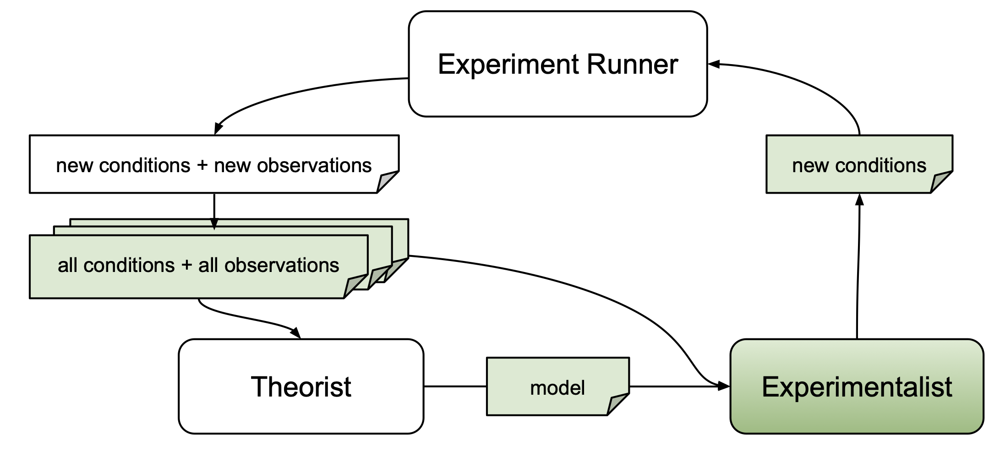

# Experimentalist Overview

The primary goal of an experimentalist is to identify experiments that yield 
scientific merit. ``autora`` implements techniques for automating the identification 
of novel experiments.

An experiment consists of a series of **conditions** $\vec{x} \in X$. The variables manipulated in each condition 
are defined as **independent variables**. As an example, consider a visual discrimination task in which participants are presented
with two lines of different lengths, and are asked to indicate which line is longer. There are two independent variables in this experiment: the length of the first line and the length of the second line, which each have values (e.g., 2.0 cm for the first line and 2.1 cm for the second line). Thus, *a condition is a vector of values that corresponds to a specific combination of values of the independent variables $x_i$.*

Experimentalists may use information about candidate models $M$ obtained from a theorist, 
conditions that have already been probed $\vec{x}' \in X'$, or 
respective observations $\vec{y}' \in Y'$. The following table includes the experimentalists currently implemented
 in ``autora``.

| Name               | Links                                                                                                                                                                                          | Description                                                                                                                                                                                                                                                          | Arguments   |
|--------------------|------------------------------------------------------------------------------------------------------------------------------------------------------------------------------------------------|----------------------------------------------------------------------------------------------------------------------------------------------------------------------------------------------------------------------------------------------------------------------|-------------|
| Random             | [Package](https://pypi.org/project/autora-core/), [Docs](https://autoresearch.github.io/autora/user-guide/experimentalists/random/)                                                     | An experimentalist with pooling and sampling functionality. The pooler creates combinations of conditions from lists of discrete values using random selection; the sampler draws from a pool of conditions without replacement using uniform random sampling.       |             |
| Novelty            | [Package](https://pypi.org/project/autora-experimentalist-novelty/), [Docs](https://autoresearch.github.io/autora/user-guide/experimentalists/novelty/)                       | Identifies conditions $\vec{x}' \in X'$ with respect to a pairwise distance metric applied to existing conditions $\vec{x} \in X$.                                                                                                       | $X'$        |
| Uncertainty        | [Package](https://pypi.org/project/autora-experimentalist-uncertainty/), [Docs](https://autoresearch.github.io/autora/user-guide/experimentalists/uncertainty/)               | Identifies conditions $\vec{x}' \in X'$ with respect to model uncertainty, which can be calculated in three different ways.                                                                                                              | $M$         |
| Model Disagreement | [Package](https://pypi.org/project/autora-experimentalist-model-disagreement/), [Docs](https://autoresearch.github.io/autora/user-guide/experimentalists/model-disagreement/) | Identifies conditions $\vec{x}' \in X'$ with respect to a pairwise distance metric between theorist models, $P_{M_{i}}(\hat{y}, \vec{x}')$.                                                                                              | $M$         |
| Falsification      | [Package](https://pypi.org/project/autora-experimentalist-falsification/), [Docs](https://autoresearch.github.io/autora/user-guide/experimentalists/falsification/)                                           | An experimentalist with pooling and sampling functionality that generates and samples from novel conditions under which the loss $\hat{\mathcal{L}}(M,X,Y,X')$ of the best candidate model is predicted to be the highest.                             | $M, X', Y'$ |
| Mixture            | [Package](https://pypi.org/project/mixture-experimentalist/), [Docs](https://autoresearch.github.io/autora/user-guide/experimentalists/mixture/)                                      | Uses a mixture of specified sampling strategies to identify novel conditions. Conditions are selected based on a weighted sum of scores obtained from the specified strategies.                                                          | $M, X', Y'$ |
| Nearest Value      | [Package](https://pypi.org/project/autora-experimentalist-nearest-value/), [Docs](https://autoresearch.github.io/autora/user-guide/experimentalists/nearest-value/)           | Returns the nearest values between the input samples and the allowed values, without replacement.                                                                                                                                                    | $X'$        |
| Leverage           | [Package](https://pypi.org/project/autora-experimentalist-leverage/), [Docs](https://autoresearch.github.io/autora/user-guide/experimentalists/leverage/)                     | Identifies conditions using the statistical concept of leverage to refit candidate models iteratively with the leave-one-out method.                                                                                                     | $M, X', Y'$ |
| Inequality         | [Package](https://pypi.org/project/autora-experimentalist-inequality/), [Docs](https://autoresearch.github.io/autora/user-guide/experimentalists/inequality/)                 | Uses a pairwise distance metric to compare and select new conditions. This metric along with a difference threshold are used to calculate inequality scores for candidate conditions, and conditions with the highest scores are chosen. | $X'$        |
